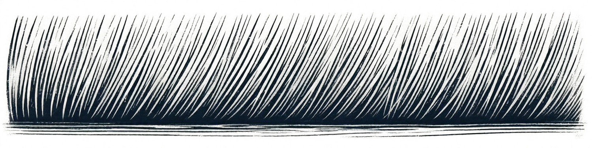

# Chapter 8: The Acceleration

Six seasons passed.

The young ones bred. The female with a male from a neighboring territory who had his own stone patterns, his own mathematics. The two males found mates similarly—females who understood the work, who contributed their own calculations. The pairings were functional. Complementary mathematics. Shared purpose.

Aurelia didn't attend the pairings or involve herself in the breeding. She worked. The pattern had grown beyond massive. It sprawled across territories, incorporating natural features into its structure. A particular tree stood at one calculation node. A boulder marked another. The entire landscape had become encoded with meaning.

She stood in positions of stillness more often than not now. A full lunar cycle could pass with her motionless in a single spot, processing complexity that required days of uninterrupted calculation to resolve. The young ones—no longer young, fully adult now—brought her food. Placed it within reach. She consumed it automatically, never breaking concentration. Barely registering their presence.

They had learned to continue work during her stillness. Her pattern had its own logic now, its own internal consistency. They could extrapolate next steps, place the next hundred stones following the mathematical grammar she had established. When she emerged from stillness, she would examine their work, make minor corrections, then move on to the next section that required her deeper processing.

The mammals had changed across six seasons. The tool-using population had exploded. Forty individuals now where there had been one. Tool use was universal in this group. Passed from parent to offspring with complete reliability. Some individuals showed innovation—creating new tool types, finding new applications. The cognitive threshold had been crossed. Was continuing to cross, each generation slightly more capable than the last.

Aurelia had expanded protection to other mammal species. The tree-dwellers with grasping hands. The ones who nested in family groups. The ones who demonstrated social complexity beyond simple hierarchy. Each species selected for specific traits. Each protected, guided, shaped toward a future they couldn't imagine.

Fifteen mammal lineages now under active cultivation. Fifteen separate probability trees. Most would terminate in extinction. But maybe one would persist. Maybe one would survive the impact winter, adapt to the changed world, continue evolving toward the necessary endpoint.

Maybe.

The wrongstar dominated the night sky now. Brighter than anything except the moon. Visible during the day as a distinct disk if one knew where to look. Everyone knew where to look.

1,089 rotations remaining.

---

Across the landscape, the work had intensified globally.

The Builder's stone formations covered the entire flat rock now and extended into surrounding territory. Other builders had joined him—younger ones who learned his grammar and contributed their own sections. The pattern was becoming a language. A means of encoding information that could persist through catastrophe.

The Carver had died.

Her cliff face stood complete, every available surface covered in intricate patterns. Younger carvers continued her work on adjacent cliffs. Miles of stone now encoded with information. Genetic sequences. Environmental specifications. Timelines and thresholds and instructions for processes that wouldn't begin for millions of years.

The Pair had not reunited. They worked in territories hundreds of miles apart, each developing patterns that mirrored the other's with such precision that the distance between them seemed irrelevant. Whatever communication they had established during their months of stillness, it persisted. Nonlocal correlation. Mathematics that transcended physical proximity.

And everywhere, the smaller ones worked on their own contributions. Some calculated climate recovery timelines. Others focused on specific elements of the evolutionary chain—not just the endpoint of technological civilization but the thousand intermediate steps. Fire use. Agriculture. Social structures capable of supporting specialization. Language. Writing. Mathematics itself as teachable concept rather than intuitive awareness.

The amount of information being encoded was staggering. Redundant across thousands of individual contributions. Different perspectives on the same problem. Different solutions converging on the same necessary outcome. Planetary defense capability emerging in 65 million rotations plus or minus three percent.

It should have been impossible. The precision required. The scope of calculation. The assumption that anything they did would persist through the impact and beyond. That crushed stone patterns would somehow influence evolution across deep time. That mammals with barely functional cognitive capacity would someday build satellites and redirect asteroids.

The mathematics said possible. Just barely. Just maybe.

And so the work continued with desperate intensity.

---

Aurelia had been standing still for forty-three days now. Her longest calculation yet. The pattern section she was processing required integrating every other section, all the work of all the contributors, into a unified timeline. The master calculation that would bind individual efforts into cohesive whole.

Around her, the adults who had been her young continued work. Her daughter—the female—brought food daily. Groomed the Watcher's feathers occasionally, removing parasites and debris from a body that no longer moved enough to maintain itself. The males maintained the protected mammal populations, drove away predators, ensured the selective breeding continued.

In the margins of the territory, past the marked stone where the other one's body had dispersed, a young pair had taken up residence. Male and female, working on their own smaller pattern. They kept respectful distance from the Watcher's territory but clearly understood the work. Were contributing their own calculations to the larger structure.

The network of understanding had spread across the entire species. Not every individual could calculate to the depth the Watcher could. But every individual capable of abstract thought contributed what they could. Mathematics distributed across thousands of minds, each processing what they could process, all results feeding into the whole.

Collective intelligence not through communication but through parallel processing. Through shared observation and common purpose. Through mathematics that existed as objective truth regardless of who calculated it.

On the forty-third day, the Watcher's calculation completed.

She moved—the first movement in over a lunar cycle. Her body was stiff. Muscles had atrophied slightly. She needed water desperately. Food. Recovery time.

She went immediately to the pattern's center and began placing stones.

The section she added connected everything. Every regional contribution. Every individual calculation. Every probability tree and timeline and threshold. She encoded the master plan in geometric relationship and spatial positioning. The pattern became a map. A guide. A recipe for creating technological civilization from small mammals given 65 million years and specific environmental conditions.

It took seventeen days to place all the stones for this section. She didn't stop except when her body absolutely required rest. Her daughter stayed close, providing food and water, maintaining vigil. Understanding that this was the critical work. The reason for everything.

When the last stone of the master section was placed, the Watcher stood back and looked at what she had created.

From ground level, it was chaos. Stones scattered across miles of territory. No apparent order. No visible meaning.

From her mind's eye view—from the conceptual perspective where mathematics existed as pure relationship rather than physical instantiation—it was beautiful. Complete. Sound.

If the mammals survived. If they evolved as calculated. If the traits she had selected propagated. If the environmental conditions post-impact fell within the estimated range. If a thousand other variables aligned. If probability collapsed in their favor.

Then in 65 million years, plus or minus a few million, there would be minds capable of reading this pattern. Capable of understanding what it meant. Capable of recognizing that their own development had been guided from the beginning.

And they would build what needed to be built. They would protect what needed protection. They would do what she could not do because she would be dead and her entire species would be dead and the world would be so changed as to be unrecognizable.

But the mathematics would persist. The plan would unfold. The activation sequence would trigger.

Or it wouldn't. The probability was still impossibly small. Still required everything to go correctly across timescales so vast they became abstract. Still depended on chaos collapsing into order in ways that violated every principle of entropy.

But it was possible. The mathematics said possible. And that was all she had.

---

That night, she stood at the clearing's edge and watched the wrongstar. It was growing visibly now. Day to day, it increased in size. Soon it would develop a tail—the characteristic signature of near approach. The atmosphere beginning to interact with its matter. Friction and heat and the final acceleration toward impact.

1,046 rotations remaining.

Behind her, in the hollow that had been hers for years, her daughter settled with her own young now. Three tiny hatchlings who would be adolescent by the time of impact. Who might survive if they were lucky. Who might carry forward some fragment of knowledge if they survived.

In the protected territories, the tool-using mammals slept in their burrows. Sixty individuals now. Tool use universal. Some showing fire interest—gathering to watch lightning-struck flames, observing the effects of fire on food. Not controlling fire yet. But watching. Learning. The foundation for the next threshold.

400,000 years after impact, if they survived, they would discover fire. Not random discovery. Encoded instinct would draw them toward it. Make them less afraid than they should be. Give them capacity to observe and learn rather than flee. The activation sequence beginning its long, patient unfold.

In the trees, the grasping-hand mammals slept in family groups. Showing social complexity. Showing tool use of their own kind. Parallel development. Redundancy. If one lineage failed, perhaps another would succeed.

Across the continent, thousands of individuals worked or rested or bred or died. All contributing what they could to a plan so vast and uncertain that belief in it was itself irrational. But the mathematics was sound. The calculations held. And what else could they do but try?

Aurelia looked at the wrongstar and ran the impact timeline one more time. Velocity and trajectory and angle of approach. Mass and composition estimates. Impact energy. Global effects cascade. Climate disruption duration. Recovery timeline.

99.7% of large organisms would die within three years. 94% of all species extinct within ten years. The world transformed. The climate shifted. The ecosystem collapsed and rebuilt from extremophiles and survivors and small creatures who could hide and wait.

And maybe—just maybe—some of those small creatures would carry altered genetics. Would have slightly larger brains. Would show slightly higher cognitive capacity. Would use tools and eventually fire and eventually so much more.

Maybe.

She turned from the wrongstar and walked to where the marked stone stood. The place where the other one had dispersed. Grass grew around it now. Small plants. Life reclaiming the disturbed earth. The stone itself was just a stone. Meant nothing. Marked nothing that mattered to anyone except her.

She stood there for a while. Ran no calculations. Thought nothing useful. Just stood.

Then she returned to her hollow. Her daughter's young chirped at her approach—tiny sounds, instinctive. She settled near them, warming them with her bulk. Her daughter watched with what might have been gratitude or might have been simple acknowledgment.

In the morning, the work would continue. Tomorrow, the pattern would grow. Tomorrow, the mammals would be protected and guided and shaped. Tomorrow, the wrongstar would be brighter still and the rotations would tick down and the inevitable would draw closer.

1,046 rotations remaining.

She would use them all.
