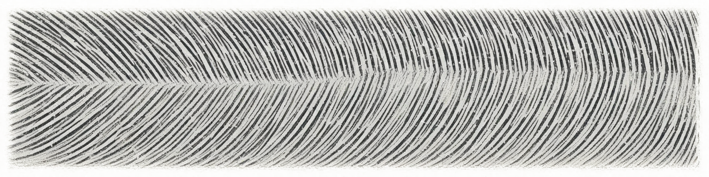

# Chapter 10: The Architects

She had been still for forty-two days. The longest calculation yet. Longer even than the master pattern integration. This was different. This was final verification. Final confirmation that everything connected. That every piece of the vast, complex plan fit together into a coherent whole.

Around her, life continued. Her family brought food. The mammals foraged under protection. The wrongstar grew bright enough that it dominated both day and night sky, a burning presence that no one could ignore.

742 rotations remaining.

But she calculated beyond those rotations. Calculated through the impact. Through the extinction. Through the slow, grinding recovery of ecosystems from extremophile survivors. Through the emergence of new dominance hierarchies. Through millions of years of evolution guided by the encoded traits she had selected for.

Tool use at generation 17,000.
Fire control at generation 200,000.
Agriculture at generation 600,000.
Writing at generation 1,500,000.
Mathematics at generation 2,100,000.
Astronomy at generation 2,500,000.
Planetary defense at generation 3,250,000.

Seven thresholds. Seven capabilities. Seven stages from nothing to salvation. She had no concept of the number's significance. Only that the mathematics was complete.

If the activation sequence triggered. If the encoded traits expressed. If evolution followed the calculated path. If civilization emerged. If they developed the capability.

If.

On the forty-second day, the calculation completed. Every variable checked. Every probability confirmed. Every pathway verified. The mathematics was sound. The plan was coherent. The encoding was correct.

Eight percent probability remained eight percent. No refinement changed it. No optimization improved it. Eight percent was the mathematical ceiling given current conditions and available resources and the fundamental constraints of biology and time.

It would have to be sufficient.

She moved.

---

The pattern sprawled across the landscape. Thousands of stones positioned with geometric precision. The mathematics made physical. But there was one section left unmarked. One piece that needed closure.

She walked to the marked stone. The place where the other one's matter had dispersed. Grass and small flowers grew around it. The stone itself showed weathering from seasons of exposure. But it remained.

She picked up three small stones from the pattern's edge. Carried them to this location. Arranged them in specific geometry around the marker. The same configuration she had used at the very beginning. The first pattern she had ever created. The foundation from which everything else had grown.

Three stones. Simple. Primary. Complete.

The configuration meant something. Encoded specific information. But it also meant nothing except to her. Personal notation. Acknowledgment. Recognition that his contribution mattered to the calculation even if his matter no longer existed in assembled form.

The stones were placed. The marker was complete. She stepped back and looked at what she had created.

Then she returned to the pattern's center and began the final verification walk.

---

She moved through the entire pattern. Every section. Every subsection. Every cluster of stones that encoded specific information. Her movement was methodical, systematic. She examined each placement, confirmed each relationship, verified each calculation rendered in physical form.

The daughter's atmospheric recovery section: mathematically sound.

The male's ocean recovery section: correct.

The other male's geological processes section: verified.

The neighbor's contributions to genetic mapping: accurate.

The Builder's timeline: complete.

The Carver's genetic sequences: preserved in stone.

Every piece checked. Every connection confirmed. The entire vast edifice of planning and calculation and desperate hope holding together as coherent whole.

The verification walk took three days. When she finished, she returned to the center and stood looking at the mammal territories visible from this position. The tool-users to the east. The tree-dwellers to the west. The social-complexity group to the north. All visible from this central point. All marked. All prepared.

The wrongstar filled a quarter of the sky now. Its tail streamed behind it like a banner. The heat from it could be felt even during the day. The end was approaching not as abstract calculation but as visible, tangible reality.

She watched the tool-user territory until the mammals emerged for evening foraging.

---

The family group appeared on schedule. Nine individuals. The original tool-user—elderly now by mammal standards, moving more slowly but still alive—led the group. Younger adults followed. Adolescents bounded ahead with excess energy. Infants clung to parents' backs.

The original tool-user paused at the entrance to its burrow. Bent down. Picked up a stick.

It was a specific stick. The one it had been using for seventeen days now. Shaped through use into optimal configuration. One end worn smooth from handling. The other end sharp from repeated insertion into insect colonies.

The mammal examined the stick. Tested its weight. Checked the sharpness of the working end. Then it set the stick down carefully at the burrow entrance. Deliberately. Precisely. In a specific position where it could be easily found tomorrow.

It would use that stick again tomorrow. And the day after. Would use it until it broke or wore out, then create another like it. Had already taught the technique to offspring, who practiced with their own sticks. Had demonstrated the optimal shape, the best working techniques, the maintenance procedures.

Aurelia had waited seventeen generations for this mutation.

---

The small creature extracted grubs from the rotted log with the stick, ate them one by one, then set the stick aside carefully, deliberately, for reuse. Tool creation. Tool maintenance. Tool culture. Everything she had selected for, now expressing reliably across a population.

The creature would not understand for millions of years.

None of them would.

But they would discover fire when their population density reached the threshold she had calculated. They would develop agriculture when the climate stabilized 10,000 rotations after impact. They would invent writing when their vocal structures evolved the three specific markers she had selected for in generation forty-three of the breeding program.

They would look at the stars, and something buried deep in structures she had carefully, painstakingly encoded, would whisper: *calculate*.

They would call it curiosity.

They would call it genius.

They would call it inspiration.

They would wake at dawn with ideas they couldn't explain. Would feel driven to create things they didn't understand the purpose of. Would sacrifice comfort, stability, relationships—for the work. And they would never know whether the drive came from within or was whispered through time by careful hands.

She had called it activation.

They would be so proud of each discovery. So certain of their own brilliance. They would build towers of achievement and call themselves the authors. They would trace their history and see nothing but their own clever progression from simple to complex.

They would never know that every threshold had been programmed. That every breakthrough was scheduled activation. That their entire civilization was executing code written 65 million years ago by minds that could hold entire evolutionary timelines in conscious calculation.

She had done this for him.

For their hatchlings who died before understanding. For the other one who helped even when he couldn't fully comprehend the scope. For every individual who contributed what they could calculate and trusted that it mattered to something larger.

The small mammals would never know the cost. Would never know that every human—she had no word for what they would call themselves, but they would be human in form and function—every human who felt something for their children, who worked to build something beyond themselves, who sacrificed for a future they wouldn't see—was echoing her.

That feeling wasn't in the code.

That feeling was why there was a code at all.

The mathematics could encode capability. Could schedule activations. Could guide evolution through millions of years toward specific endpoint. But the impulse to create the code—the reason to spend years in desperate effort, to sacrifice everything, to calculate across time scales that made individual existence meaningless—that impulse couldn't be programmed.

That impulse was the only thing that was real.

And it would propagate forward not through genetic encoding but through the simple fact of consciousness recognizing the value of its own continuance. Through minds that understood mortality calculating ways to transcend it. Through life that knew it would end working to ensure something else would begin.

The mammals would feel it too. Millions of years from now. They would look at their own extinction probability and calculate ways to reduce it. Would build their own desperate plans. Would sacrifice their own present for an uncertain future. Would encode their own gifts for civilizations they would never meet.

And they would think they chose it. Would believe the impulse was theirs. Would call it noble or necessary or just what intelligent beings do.

They would be right and wrong. The impulse would be theirs. But the capability would be hers. The activation would be scheduled. The timeline would unfold as calculated.

Or it wouldn't.

The mammal finished with the stick. Cached it carefully. Led its family to new foraging territory. Disappeared into the undergrowth.

Aurelia stood watching the empty space where they had been. Ran the calculation one final time. From this moment forward across 65 million years to planetary defense capability.

Eight percent.

She returned to stillness. The verification was complete.

---

Somewhere, 65 million years in a direction she could not imagine, in a time that made the calculation of it feel like abstraction rather than eventual reality, a human woman stared at a computer screen.

The genetic sequence made no sense. Too regular. Too purposeful. Repeating elements that shouldn't repeat. Mathematical relationships encoded in DNA that should be random noise.

She highlighted the first cluster. Ran correlation analysis against neural development markers.

Tool use.

The structures in the human brain that enabled hands to manipulate objects with precision. That linked visual processing to motor control. That allowed abstract representation of physical relationship. All encoded in a specific genetic sequence. All activating at a specific point in evolutionary timeline.

Her hand trembled as she highlighted the second cluster.

Fire control. The reduced fear response to flame. The enhanced pattern recognition for combustion conditions. The cognitive structures that enabled risk assessment and controlled use of dangerous elements.

Third cluster. Agricultural timing. Seasonal awareness. Plant domestication capability. Long-term resource planning.

Fourth. Fifth. Tenth. Twentieth.

Every major human capability. Every threshold that separated homo sapiens from our ancestral primates. Every innovation that built civilization.

All encoded. All scheduled. All activated according to timeline that existed before humanity existed.

She sat back from the screen. The laboratory was silent. The implications were...

She couldn't process the implications. Not yet. First she needed to confirm. To verify. To check every calculation and make certain she wasn't seeing pattern where only noise existed.

But the mathematics was sound. The correlation was too strong to dismiss. The activation timeline matched archaeological record with precision that couldn't be coincidental.

Humanity was not the author of its own progress.

Humanity was executing a program.

---

Aurelia returned to stillness. The calculation was complete. The verification was done. The message was encoded in stone and flesh and the patient mathematics of deep time.

742 rotations remaining.

She would spend them in preparation. In ensuring the mammals had maximum survival probability. In making final adjustments to the pattern. In waiting for the inevitable.

But the work was finished. The plan was complete. The activation sequence was set.

In 65 million years, a species that didn't yet exist would read the pattern. Would understand what they were. Would know that every achievement they claimed was gift from extinct intelligence that loved its world enough to ensure something survived.

And they would build the defense grid. Would detect the next asteroid. Would redirect it. Would protect the planet from the catastrophe that was coming—not for them, but for something that would come after them. Some next iteration of consciousness that didn't yet exist but would, if the pattern held, if the mathematics was sound, if the activation sequence continued forward into time scales that made 65 million years look brief.

The cycle would continue. The protection would propagate. The code would execute across geological epochs. And consciousness—that strange emergent property of matter organized in specific configuration—would persist.

Not any specific consciousness. Not her or the mammals or the eventual humans or whatever came after. Just consciousness itself. The universe's way of experiencing itself. Of calculating its own continuation. Of choosing to persist rather than to end.

If that's what choice meant.

If choice existed at all.

If it mattered whether it did.

Aurelia stood still as stone itself. The wrongstar burned above. The mammals lived their protected lives. The family maintained the territories. The pattern existed complete and verified and ready for eventual reading.

The mathematics was complete.

And somewhere in a direction that time flowed forward toward, a human woman sat staring at a screen and feeling the ground drop away beneath her understanding, feeling everything she thought she knew about human achievement invert and collapse into a new configuration that was somehow both devastating and beautiful.

We were never alone. We were never the first. We were never the authors.

We were the inheritors. The activation. The execution of a plan so vast and patient that it made human timescales look like heartbeats.

And the dinosaurs who wrote it were so incomprehensibly intelligent that they could calculate 65 million years forward and encode the result in genetics and stone and mathematical relationships that persisted through extinction.

We called ourselves sapiens. Wise.

They called us activation sequence.

And they had been right.
