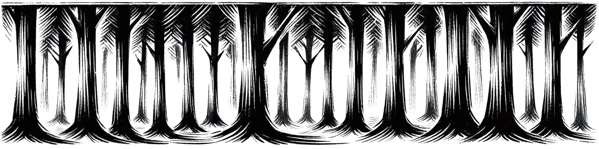

# Chapter 17: The Correlation

Sarah didn't go home. Didn't sleep. By 9 AM she had consumed four more cups of coffee and documented seventeen distinct activation sequences in the human genome. By noon she had cross-referenced all of them against archaeological and anthropological data. By 3 PM she was staring at a timeline that made her question whether reality was real.

Every sequence. Every single one. Correlated with a major evolutionary threshold.

She had created a visualization—a simple chart with two timelines. Archaeological record on top. Genetic activations on bottom. The lines matched so perfectly it looked fabricated.

Tool use: 2.6 million years ago. Both timelines.
Fire control: 400,000 years ago. Both timelines.
Symbolic thought: 100,000 years ago. Both timelines.
Agriculture: 12,000 years ago. Both timelines.
Writing: 5,000 years ago. Both timelines.
Mathematics: 2,500 years ago. Both timelines.

On and on. Every threshold. Every breakthrough. Every capability that made humans human.

All of it was in the code. Scheduled. Timed. Activated precisely when needed.

Her office phone rang. She ignored it. It rang again. Again. Finally she picked up.

"Dr. Chen, this is Janet from the Dean's office. We've been trying to reach you. You missed your lecture this morning and—"

"I quit," Sarah said.

Silence on the other end.

"I'm sorry, what?"

"I quit. I'm resigning. Effective immediately. Send me whatever paperwork. I'll sign it."

"Dr. Chen, you can't just—"

Sarah hung up. Unplugged the phone from the wall. Went back to her computer.

She needed to talk to someone. Needed verification. Needed another set of eyes on this data before she lost her mind completely.

James Wei. Archaeologist. They'd collaborated on a paper five years ago about cognitive evolution. He was solid. Careful. Skeptical in the good way—demanded evidence before accepting claims.

She pulled up his contact info and called his cell.

"James Wei."

"James, it's Sarah Chen. I need you to look at something. Right now. Today. Can you come to my lab?"

"Sarah? I'm in the middle of—"

"I found something in the human genome. Something that correlates with your archaeological timeline. Perfectly. Impossibly perfectly."

Pause. "What kind of correlation?"

"Just come. Please. I can't explain over the phone. You need to see the data."

Another pause. Longer. "Give me two hours."

---

James arrived in ninety minutes. He was tall, thin, perpetually rumpled in the way academics who didn't care about appearance often were. He had his laptop bag and what looked like half his office in a cardboard box.

"Okay," he said without preamble. "Show me."

Sarah pulled up the visualization. The two timelines. The perfect correlation.

James stared at it for a long time. Too long. Sarah was about to prompt him when he finally spoke.

"This is fake."

"It's not."

"Then your data is corrupted."

"It's not."

"Then your analysis is wrong."

"It's not."

He turned to look at her. Really look at her. "Sarah, when was the last time you slept?"

"Show me I'm wrong," she said. "Show me any error in the methodology. Any contamination in the data. Any mistake in the correlation analysis. Show me and I'll admit I'm wrong."

James sat down. Started going through her documentation. He worked in silence for three hours, checking every calculation, every correlation, every cross-reference. Sarah made more coffee and watched him work and tried not to think about Maya or her resigned position or the fact that her entire life was currently imploding.

Finally, James sat back. Rubbed his face. Looked at the timeline again.

"Fuck," he said quietly.

"Yeah."

"This is... Sarah, do you understand what you're suggesting?"

"That human evolution was programmed. That every major breakthrough in our development was scheduled. That we're not the authors of our own progress."

"That's insane."

"Show me where the data is wrong."

He couldn't. She could see him trying. See him looking for any way to dismiss it. Any explanation that didn't require accepting the impossible.

"Newton and Leibniz," he said finally.

"What?"

"Newton and Leibniz both invented calculus independently. Within years of each other. Different countries. No communication. How do you explain that?"

Sarah pulled up another data set she'd been analyzing. "Activation wave. Look at the timeline for advanced mathematical reasoning capability. It doesn't activate uniformly across the population. It activates in waves. First a few individuals. Then more. Then widespread. Newton and Leibniz both got the first wave. They weren't geniuses who happened to discover the same thing. They were both activated at the same time."

James stared at her. "You're telling me genius is just... scheduled?"

"I'm telling you the capability for genius is scheduled. What individuals do with it might be up to them. But the capacity itself? The cognitive architecture that makes advanced mathematics possible? That activates on a timeline. And that timeline was set 65 million years ago."

"By who?"

"That's the question, isn't it?"

James stood up. Paced to the window. Looked out at the campus. Normal people doing normal things. Students heading to class. Professors discussing research. The regular world where evolution was random and humanity was self-made.

"I need to show you something," he said. "I've been documenting simultaneous discoveries. It started as just an interesting pattern I noticed. Darwin and Wallace both proposing natural selection at the same time. Kelvin and Joule both working on thermodynamics. Helmholtz and Mayer both discovering energy conservation. I thought it was just convergent thinking. Same problems, similar solutions."

He pulled files from his cardboard box. Papers. Notes. Timelines of his own.

"But I kept finding more. Every major innovation has multiple independent discoverers. Not just two. Sometimes five. Sometimes ten. All working on the same problem. All arriving at the same solution. All within the same narrow time window."

He spread the papers across Sarah's desk. "I thought it was coincidence. Or something about the human condition—we're ready for certain ideas at certain times. Cultural readiness. Technological foundation. That kind of thing."

Sarah was already pulling up her genetic timeline. Cross-referencing. The activation waves. The periods when certain capabilities expressed more strongly across populations.

"It's not cultural readiness," she said slowly. "It's activation waves. Look—the steam engine. Multiple inventors across Europe within twenty years. Right here—mechanical engineering capability activating. Widespread expression."

"The telephone. Bell and Gray filed patents on the same day."

"Communication technology activation. Right here in the sequence."

"The internet. Multiple research groups independently—"

"Information processing architecture. Activated thirty years ago. Widespread expression last decade."

They looked at each other across the desk covered in papers and genetic printouts and timelines that all told the same impossible story.

"Someone programmed human development," James said. It wasn't a question anymore.

"Sixty-five million years ago."

"The K-T extinction."

"Exactly when the dinosaurs died."

Long silence. Outside, a bird landed on the window ledge. Ordinary. Normal. Oblivious to the revelation happening inside.

"Why?" James asked finally. "Why would anyone—why would anything—program human evolution? What's the purpose?"

Sarah pulled up the last section of the genetic sequence. The one that was still dormant. Still waiting to activate.

"I don't know yet. But there's one more threshold coming. And I think when we figure out what it's for, we'll understand the whole thing."

James leaned forward to look at the sequence. "When does it activate?"

"Soon. Within five years. Maybe sooner."

"What does it do?"

"I don't know. The correlations are complicated. It touches multiple systems. Neural structures. Sensory processing. Something to do with spatial reasoning and physics comprehension and..." She trailed off, staring at the data.

"What?"

"Oh god. James, I think this is engineering capability. Advanced engineering. Planetary-scale engineering."

"For what?"

Sarah pulled up comparative analysis. Cross-referenced with astronomical data. Let the pattern recognition software run its course.

The results came back and Sarah's blood went cold.

"Asteroid defense," she whispered. "James, this capability is for building asteroid defense systems."

They stared at the screen in silence.

Finally James said, "There's someone you need to meet. Engineer. Marcus Chen—no relation to you, I assume?"

"No."

"He's been working on satellite systems. Some kind of gravitational anchor network. Been obsessed with it for months. Says he can't explain where the ideas are coming from. Just that he knows they're correct. Knows they'll work."

Sarah's hands were shaking again. "When did he start this work?"

"Six months ago. Sudden onset. Said he woke up one morning and just... knew how to build it."

"He's activated," Sarah said. "He's one of the first. The engineering capability is activating and he's expressing it."

"Sarah, if you're right—if this is all real—we need to tell people. We need to—"

"Tell them what? That free will is an illusion? That every achievement humanity has ever claimed is just scheduled activation of pre-written code? That we're not the authors of our own story?" She laughed without humor. "How do you think that goes over?"

"But if there's another activation coming—if people are about to start building asteroid defenses—"

"Then maybe we need to understand it first. Before we announce to the world that humanity is a program."

James sat down heavily. "I need a drink."

"It's 3 PM."

"I need several drinks."

Sarah's phone—her personal cell, sitting face-down on the desk—buzzed. And buzzed. And buzzed. She'd turned it back on at some point. Messages flooding in. Her ex. The school. Probably her department head about the resignation.

She picked it up. Seventeen messages. Most from her ex. Three from a number she didn't recognize. She opened those first.

*Dr. Chen, this is Principal Morrison from Maya's school. We need to speak with you about your daughter. Please call as soon as possible.*

*Dr. Chen, this is urgent. Maya had an incident today. She's fine but we need you to come in.*

*Dr. Chen, your ex-husband picked Maya up. Please contact us to schedule a meeting about her behavior.*

Sarah's stomach dropped. She dialed the school. Got the principal's voicemail. Tried her ex.

He answered on the first ring. "Jesus Christ, Sarah, where have you been?"

"What happened? Is Maya okay?"

"She's fine. Physically. But she tried to run away from school. Got all the way to the street before a teacher caught her. Said she was trying to come find you."

The guilt hit like a physical blow. "I'm coming. Right now. I'm—"

"Don't. She's asleep. Finally. After crying for two hours. The school counselor says she's processing abandonment. Apparently you've been 'too busy' for her lately."

"I'm working on something important. I can't—"

"More important than your daughter?"

Yes, Sarah wanted to say. This is bigger than one child. This is the nature of humanity. This is everything we thought we were turning out to be a lie.

But she couldn't say that. Couldn't explain. Couldn't justify choosing cosmic truth over maternal presence.

"I'll come tomorrow," she said.

"Sarah—"

She hung up. Put the phone down. Looked at James, who was very deliberately studying the timeline and not making eye contact.

"I'm a terrible mother," she said.

"I don't have kids. Can't judge."

"You're judging."

"Little bit, yeah."

Sarah laughed. Nearly hysterical. Nearly crying. "My daughter tried to run away to find me and I'm here proving that humanity is programmed. What does that say about me?"

"That you're human," James said. "That you're doing what you were designed to do. Following the compulsion to understand. To analyze. To discover." He paused. "Or maybe you're just using work to avoid dealing with your failures as a parent. I'm an archaeologist, not a therapist."

"Wow. Thanks."

"You asked."

Sarah looked at the timeline again. At the proof that humanity was executing code. At the evidence that every choice might be predetermined. At the possibility that her obsession with work and her failures with Maya were both just subroutines running their course.

"If we're programmed," she said slowly, "then am I even choosing to be a bad parent? Or is that just part of my coding?"

"Does it matter?"

"Of course it matters. If I don't have free will, then I can't be blamed for my failures. But I also can't be credited with my successes. Nothing means anything."

James shook his head. "You're a geneticist. You know genes aren't destiny. They're tendency. Probability. The code gives you capacity—what you do with it is still yours."

"Is it?"

"I don't know, Sarah. I study dead civilizations. Not philosophy."

They sat in silence. The timeline on the screen. The evidence of programming. The impossible truth that changed everything.

"I need to meet him," Sarah said finally. "Marcus Chen. The engineer who's building asteroid defenses without knowing why. I need to understand what's happening to him."

"I'll set it up."

"And we need more people. We can't verify this alone. We need other geneticists. Other experts. We need a team."

"Agreed. But carefully. If this gets out before we understand it—"

"Panic. Existential crisis. Collapse of every religious and philosophical framework humanity has built."

"Basically."

Sarah pulled up her email. Started drafting messages to researchers she trusted. Carefully worded. Vague about the specifics. Just enough to get them curious.

Her phone buzzed again. Another message from her ex: *Maya keeps asking why you don't love her anymore. What should I tell her?*

Sarah stared at the message. At her daughter's pain reduced to a question she didn't know how to answer.

*Tell her I do love her,* she typed. *Tell her I'm trying to understand something important. Tell her I'll be there soon.*

All lies. She did love Maya. But clearly not enough to choose her over this work. Not enough to prioritize presence over discovery. Not enough to be the parent Maya needed.

And she had no idea when she'd be "there soon." This work had just begun. The implications were vast. The investigation would take months. Years, maybe.

She sent the message anyway. Added to the pile of promises she probably wouldn't keep.

Then she turned back to the computer. To the timeline. To the evidence that humanity was executing a program written before humans existed.

To the growing certainty that she was doing exactly what she was designed to do, even if it meant failing at everything else.

The equation was unfolding.

And Sarah Chen was one of the first to see it happen.

Whether she chose to investigate or was compelled to investigate didn't matter.

Either way, she couldn't stop.

The code was running.

And she was running with it.
