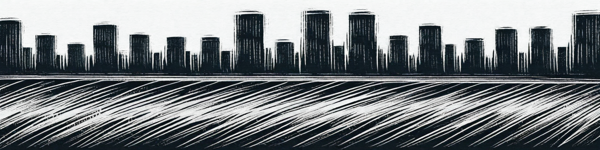

# Chapter 18: The Historian

Marcus Chen lived in a warehouse he'd converted to a workshop. When James and Sarah arrived, they found him surrounded by equipment that looked half-finished and entirely insane—metal frameworks, circuit boards, holographic projections, calculations covering every available wall surface.

He was in his early forties, Asian-American, with hair that hadn't been cut in months and clothes that looked slept in. He was hunched over a workbench, soldering something Sarah couldn't identify, completely absorbed.

James knocked on the doorframe. Marcus didn't look up.

"Marcus, I brought someone to meet you."

"Busy."

"She's found something you need to see."

"Busy."

Sarah stepped forward. "Mr. Chen, I'm Dr. Sarah Chen—no relation. I've discovered genetic sequences that activate specific cognitive capabilities on a predetermined timeline. One of them appears to be advanced engineering capacity, and it's activating right now. In people like you."

Marcus's hand stopped moving. He set down the soldering iron carefully. Turned to look at them.

"Explain," he said.

Sarah pulled out her laptop. Showed him the timeline. The correlation data. The activation patterns. Marcus studied it without expression, his eyes moving rapidly across the screen.

"When did you start the satellite work?" Sarah asked.

"Six months ago. Woke up one morning and could just... see it. The whole system. How it would work. What components were needed. The mathematics was just there. Complete."

"Did you study this before? Have any background in gravitational physics?"

"I'm a mechanical engineer. I design industrial equipment. Nothing space-related. Nothing this complex. But six months ago..." He trailed off. Looked back at his workshop. "Six months ago I knew. Couldn't explain how. Just knew."

"Because this genetic sequence activated in you," Sarah said. "You're expressing enhanced spatial reasoning, advanced physics comprehension, planetary-scale engineering capability. It's all here in the code."

Marcus was quiet for a long time. Then: "Are you telling me this isn't me? That I'm not figuring this out? That it's just... programmed?"

"I'm telling you the capability was programmed. What you do with it might be up to you."

"Might be?"

"I don't know yet. None of us know."

Marcus turned back to his workbench. Picked up a component. Studied it. "This feels real. My ideas. My work. My breakthrough."

"I'm sure it does."

"But you're saying it's not. You're saying someone wrote this capability into my genes 65 million years ago and it just... turned on. Like flipping a switch."

"Like reaching a threshold," Sarah corrected. "Environmental triggers. Population density. Technological foundation. When conditions are right, the sequence activates."

"Why?" Marcus asked. "Why program this? Why set a timer for advanced engineering to activate right now?"

Sarah pulled up the final analysis she'd run. The one that had kept her awake even longer than the discovery itself. "Because something's coming. And we need to be able to stop it."

---

They moved to Marcus's makeshift office space—a corner of the warehouse with a desk, three monitors, and stacks of papers. Sarah pulled up astronomical data. Near-Earth object tracking. Asteroid surveys.

"I cross-referenced the genetic activation timeline with known asteroid patterns," she said. "There's a statistically significant correlation between major extinctions and the timing of this code's creation. The K-T extinction—65 million years ago—is when this sequence first appears in mammalian DNA."

"The asteroid that killed the dinosaurs," James said.

"Right. And the code that's activating now—the planetary defense capability—it's timed to mature right around when the next major impact event would be statistically likely."

She pulled up probability curves. Impact rates for objects over 1 kilometer. The distribution of near-Earth objects. The statistical likelihood of catastrophic collision over various timeframes.

"Based on impact frequency over geological time, we're due for another major event within the next 50 years. Plus or minus about 30 years."

Marcus leaned forward. Studied the data. "So someone—something—predicted this. Calculated when the next extinction event would happen. And programmed us to develop defense capability right before we'd need it."

"That's the theory."

"But who? The dinosaurs? They weren't intelligent."

"We thought they weren't intelligent," James said. "But what if we were wrong? What if intelligence doesn't look like us? What if it's possible to have profound computational capacity without language or tools or technology?"

Sarah pulled up comparative neurology. "Theropod brain structures show some interesting features. Large relative to body size. Complex neural folding. Evidence of advanced cognitive capability. We always assumed they were just smart hunters. But what if they were actually... engineers? Mathematicians? What if they could run calculations in their heads that we need computers for?"

"That's insane," Marcus said.

"So is the idea that human evolution was pre-programmed. But here we are."

Marcus stood up. Paced. His hands moved constantly—drawing invisible diagrams in the air, working through implications Sarah could see he was calculating in real-time.

"If the dinosaurs were that smart," he said slowly, "and they knew an asteroid was coming, why didn't they save themselves? Why program us instead of building their own defense system?"

"Maybe they ran out of time," James suggested. "The asteroid that killed them gave maybe a few years warning at most. Probably less. Not enough time to develop space-faring technology from scratch."

"But enough time to modify small mammals," Sarah continued. "To encode instructions. To set a timeline that would unfold over millions of years. They couldn't save themselves, so they saved the planet. Built a defense system that would be ready for the next catastrophe."

"Using us," Marcus said.

"Using us."

He was quiet for a long time. Then he went to one of his monitors and pulled up designs. Schematic after schematic. A network of satellites. Gravitational anchors. Propulsion systems. The mathematics was far beyond anything Sarah could follow, but Marcus moved through it with absolute confidence.

"This system," he said. "The one I've been designing. It's not just theoretical. I know it will work. I can see exactly how to build it. How to deploy it. How to redirect an asteroid using gravitational manipulation."

"Because that's what you were designed to do," Sarah said quietly.

Marcus looked at her. Something in his expression—anger? Fear? Resignation? "How many others? How many people are activating like me?"

"Unknown. The genetic frequency suggests maybe one in ten thousand people carry the high-expression variant. In a global population of eight billion, that's... 800,000 people. Most won't activate fully. But some percentage will. Maybe five percent. Maybe ten."

"So 40,000 to 80,000 people are all suddenly getting the same ideas," James said. "The same engineering insights. The same capability to build planetary defense systems."

"That would explain a lot," Marcus said. "I joined an online forum three months ago. Engineers and physicists working on similar problems. We thought we were just a community of amateurs with a shared interest. But the ideas—they're all variations on the same theme. Gravitational manipulation. Asteroid deflection. Planetary defense."

He pulled up the forum on one of his monitors. Hundreds of users. Thousands of posts. Designs and calculations and theories all converging on similar solutions.

"Jesus," James said. "It's happening globally."

"And it's accelerating," Marcus said. "New members join every week. People saying the same thing I said—they just suddenly knew. Couldn't explain how. Just had these complete ideas in their heads."

Sarah felt something cold settle in her stomach. "If 80,000 people are all activating the same capability at the same time..."

"Then whatever this code is designed to build, it's going to get built," Marcus finished. "Whether we understand it or not. Whether we choose to or not."

"Whether we have free will or not," James added quietly.

They all looked at each other in the silence of the warehouse. Outside, the normal world continued. People going about their lives. Unaware that their entire species might be executing a program. That free will might be an illusion. That everything humanity had achieved was scheduled activation of pre-written code.

"I need to meet others," Sarah said. "People who've activated. I need to understand what they're experiencing. How it feels from the inside."

"I'll put you in touch with the forum moderators," Marcus said. "But Sarah—these people are obsessed. Like me. Like you seem to be. They're working eighteen-hour days. Ignoring families. Destroying relationships. The compulsion is strong."

"Compulsion?"

"To build. To work. To figure this out. It's not subtle. It's overwhelming. I've tried to stop. Can't. The ideas won't leave me alone. I dream about gravitational equations. Wake up and have to sketch diagrams or I'll lose my mind."

Sarah thought of her own obsession. The coffee and the sleepless nights and Maya asking why she was never there. "I thought that was just me. Just my personality."

"Maybe it is your personality," Marcus said. "Maybe that's how the code works—it doesn't override who you are. It just... amplifies certain drives. Makes certain patterns of thought irresistible. You still feel like yourself. You're just compelled to do specific things."

"That's horrifying," James said.

"That's efficient," Marcus countered. "If you're programming a species to build something, you don't want to erase their personality. You want to work with their existing structure. Direct their drives. Make them want to do what you need them to do."

Sarah pulled up her genetic analysis again. Looked at the markers for obsessive focus. For reduced need for sleep. For enhanced motivation in specific cognitive domains. All present. All part of the activation sequence.

"We're not even human," she said quietly. "We're tools. Purpose-built tools that think they're people."

"Maybe we're both," James said. "Maybe being human includes being a tool. Maybe consciousness is always doing what it was designed to do and the feeling of choice is just... how it implements the design."

"That's philosophy, not science," Sarah said.

"This whole thing is philosophy," James shot back. "You've just proven that free will might not exist. That every major human achievement is programmed. That we're executing code written by extinct reptiles. If that's not philosophy, I don't know what is."

Marcus had gone back to his workbench. Was studying a component again. "Does it matter?" he asked without looking up. "Whether we're choosing this or compelled to it? The work still needs to be done. The asteroid is still coming. This system still needs to be built."

"You don't know there's an asteroid coming," Sarah said.

"But you think there is. You said the probability—"

"Probability isn't certainty."

Marcus set down the component. Turned to face her. "Dr. Chen, I can see this system in my head. Complete. I know it will work. I know how to build it. And I know—I don't understand how, but I know—that we'll need it. Soon. That feeling isn't rational. Isn't based on evidence I can articulate. But it's absolute."

"That's the code talking," Sarah said.

"Maybe. But what if the code is right? What if whoever programmed this knew exactly when we'd need this capability? What if they calculated it 65 million years ago and we're right on schedule?"

"Then we're not building this system because we choose to," James said. "We're building it because we were designed to build it. Because extinct dinosaurs wrote that instruction into our genes and now it's executing whether we want it to or not."

"I want to build it," Marcus said. "The compulsion is strong. But under the compulsion is genuine fascination. Genuine excitement. I love this work. It's the most meaningful thing I've ever done. So am I being forced? Or am I just discovering what I was always meant to do?"

Sarah didn't have an answer. Couldn't tell whether her own obsession with the genetic code was choice or compulsion. Couldn't separate what she wanted from what the activation sequences were making her want.

Her phone buzzed. She looked at it reflexively. Message from her ex: *Maya won't stop crying. She thinks you don't love her. Do you even care?*

Of course she cared. She loved Maya. But she was here. In this warehouse. Investigating genetic code. Documenting humanity's programmed nature. Missing her daughter's childhood to discover that childhood itself might be an execution of predetermined development stages.

Was that choice? Or compulsion? Or was the question meaningless?

"I should go," she said. "My daughter needs me."

"Will you?" Marcus asked.

"Will I what?"

"Actually go. Or will you keep working?"

Sarah looked at her laptop. At the data still open. At the analysis still incomplete. At the thousand questions still unanswered.

"I'll go," she said.

She closed the laptop. Picked up her bag. Walked toward the door.

Behind her, Marcus said quietly, "You'll be back."

Sarah stopped. Didn't turn around. "How do you know?"

"Because you're activated too. Maybe not for engineering. But for something. You can feel it, can't you? The compulsion. The need to understand. The inability to let it go."

Sarah stood in the doorway. Outside, the street was normal. Regular people doing regular things. Living lives that weren't driven by genetic activation sequences.

Or were they? Was everyone activated in some way? Was all of human behavior just code executing?

"I'll be back," she admitted. "But right now, I'm going to my daughter."

She left before anyone could respond. Got in her car. Drove toward her ex-husband's house.

Made it three blocks before she pulled over.

Sat in the parked car with the engine running and the data still in her head and the questions still unanswered and the compulsion still driving her forward.

She could go to Maya. Could be there. Could try to repair the damage.

Or she could go back to the lab. Could analyze the data. Could document the discovery that would change everything.

Maya needed her. The world needed to understand what they were.

She couldn't do both.

The choice should have been easy. Should have been obvious. Her daughter or her work. Family or discovery. Love or obsession.

But sitting in the car with the data still in her head and the compulsion still in her chest, Sarah wasn't sure she was capable of making that choice.

Wasn't sure whether that was a failure of will or a success of programming.

Wasn't sure whether the distinction mattered.

She sat there for twenty minutes. Engine running. Phone silent. The normal world continuing around her.

Then she turned the car around.

Drove back to the lab.

Hated herself for it.

Did it anyway.

The equation was unfolding.

And Sarah Chen had chosen—if choice was the right word—to watch it unfold.

Even if it meant losing everything else.
