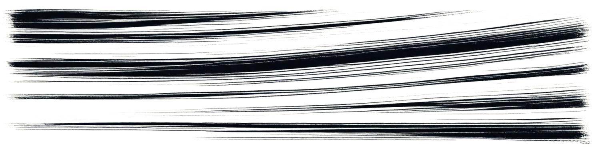

# Chapter 20: The Network

The address James sent Sarah was wrong. Or incomplete. Or deliberately obscure. She stood on a Cambridge street corner at 11 PM staring at what was supposed to be a research facility but looked more like an abandoned bookstore. Closed sign in the window. No lights visible.

Her phone buzzed: *Back entrance. Basement. -J*

She found the alley. The metal door. The stairs going down into darkness. Every horror movie instinct told her this was stupid. But the compulsion that had been building for three months—the need to understand, to collaborate, to not be alone with this knowledge—pushed her forward.

The basement was huge. Had to run under multiple buildings. Fluorescent lights. Tables arranged in a circle. Equipment everywhere—computers, lab stations, whiteboards covered in equations. And people. Twelve of them, maybe fifteen. All looking at her with the same exhausted intensity she saw in her own mirror.

"Dr. Chen." James approached. "Thank you for coming. I know this is weird. There's a reason for the secrecy."

"Who are these people?"

"Researchers. Like you. They've all found pieces of what you found. We've been meeting for two months. Comparing data. Trying to understand the whole picture before we—" He stopped. "Before we do anything we can't undo."

Sarah looked around the room. Recognized some faces from conferences. Others were strangers. All of them activated. She could see it. The intensity. The focus. The compulsion visible in body language.

"Everyone," James said. "This is Dr. Sarah Chen. Stanford genetics. She has the complete activation timeline."

A woman stood—Katherine Okonkwo, the mathematician she'd met weeks ago. "Sarah. Good. We need your data. We've been trying to map the complete sequence but we're missing regulatory regions."

"I have them. I have everything."

"Show us."

Sarah pulled out her laptop. Connected to the room's projection system. Put up the complete genetic timeline. All the activation sequences. All the thresholds. All the correlations between capabilities and historical breakthroughs.

Silence filled the basement. Everyone staring. Some had seen pieces. None had seen it all.

Finally, someone spoke. Male voice. Asian-American accent. "How far back does it go?"

Sarah turned. Recognized him from James's descriptions. Marcus Chen. The engineer. Already activating. You could see it in how he sat—absolutely still, but alert. Processing.

"First modification appears approximately 65 million years ago," Sarah said. "K-T extinction boundary. The dinosaurs encoded this right before they died."

"Sixty-five million years of planning." Katherine was at a whiteboard now, running calculations. "That's... the temporal precision required to program a species' evolution across that timeframe..."

She trailed off. Kept calculating. Numbers filling the board faster than most people could write words.

Marcus stood. Approached the projection. Pointed at the most recent activation sequence. "This one. The final threshold. When does it trigger?"

"Environmental conditions suggest within five years. Population density is at threshold. Technological base is sufficient. Climate stress might be the final trigger. Or—"

"Or the asteroid," someone else said. A physicist Sarah didn't know. "If this is defense programming, it activates when defense is needed. So the asteroid must be coming."

"We don't know there's an asteroid," Sarah said.

"Yes we do." Marcus didn't look away from the projection. "We calculated it last week. Small body, currently in outer solar system. Trajectory brings it inward. Impact probability is low but non-zero and increasing as we refine the orbital data."

"You've been tracking asteroids?"

"Everyone in this room has. Independently. Without coordinating. We all felt compelled to look. Found the same object. Ran the same calculations. Got the same results."

Marcus turned to face her. His eyes were wrong. Not in an obvious way. Just... too focused. Too certain. Like he was seeing things normal people couldn't see.

"How far out?" Sarah asked.

"Thirty-seven years. Plus or minus five. Impact probability currently eighteen percent. Rising."

The basement was completely silent.

"Jesus Christ," James said. "You're sure?"

"We're all sure. Twelve independent confirmations. Same target. Same timeline. The code knew. Whoever programmed us calculated this 65 million years ago. Set the activation to mature exactly when we'd need it."

"How?" Katherine turned from her whiteboard. "How do you calculate an asteroid impact 65 million years in advance? The system is chaotic. Three-body problem alone makes prediction impossible over that timeframe. The perturbations, the—"

"Unless you're not predicting," Marcus interrupted. "Unless you're observing. Maybe they saw it. Maybe they had detection capability we don't. Maybe they watched it start its journey and calculated when it would arrive. Math doesn't care about time. If you can measure initial conditions precisely enough, you can project forward."

"That's insane," someone said.

"So is programming mammalian evolution," Marcus countered. "We're past insane. We're in 'what's actually happening' territory now."

Sarah pulled up another data set. "I found something else. The activation doesn't hit everyone simultaneously. It's waves. Some people activate first. Others follow. There's a progression."

"Like a cascade," Katherine said, already seeing it. "Initial activation in key individuals. Then spread through the population. Optimization for rapid deployment while maintaining control."

"Control." The word hung in the air.

Marcus sat back down. "We need to talk about what this means. For us. Personally."

"It means we're programmed," James said. "We know that already."

"It means the compulsion is real." Marcus looked around the room. "Everyone here—how many hours did you sleep last night?"

Silence. A few people looked uncomfortable.

"Four hours," Katherine said. "Maybe. My brain won't shut off. Every time I try to sleep, equations. Patterns. The mathematics demands attention."

"Three hours," someone else admitted.

"I haven't slept more than five hours in six weeks," Sarah said.

Marcus nodded. "Because we're activating. The compulsion is building. I can feel it. Like pressure. Like something trying to push through. Thoughts I don't control. Knowledge I shouldn't have. Yesterday I designed a gravitational manipulation system that shouldn't be theoretically possible but I know it'll work. Know it absolutely. Can't explain how I know. Just do."

"How long have you been experiencing this?" Sarah asked.

"Six months. Started subtle. Just interesting ideas. But it's accelerating. Last week I quit my job. Didn't even think about it. Just walked out mid-day because I needed to build. Needed it like I needed air."

"That's terrifying," James said.

"That's activation." Marcus met Sarah's eyes. "How many of you feel it? The compulsion. The inability to think about anything except this."

Slowly, hands went up. Eight people. Ten. Twelve. Nearly everyone in the room except James.

"We're being taken over," someone said quietly. "By our own genetics."

"Or we're becoming what we were always meant to be," Katherine countered. "The distinction might not matter."

Sarah pulled up the final section of her analysis. "There's something else. The compulsion—I've been tracking my own neurochemistry. The activation sequences don't just enable capability. They modify motivation. Dopamine response. Reward pathways. The work provides relief. Satisfaction. Trying to focus on anything else causes discomfort."

"You're describing addiction," James said.

"I'm describing optimization. If you want to ensure a behavior, you make that behavior rewarding and make alternative behaviors unrewarding. You don't have to force anyone. You just make them want it. Make them need it."

"That's horrifying."

"That's efficient," Marcus said. "If I wanted to program a species to build a defense system, that's exactly how I'd do it. Make the builders unable to stop building. Make them feel fulfilled by the work. Make everything else feel like distraction."

He stood again. Paced. His movement was wrong too—jerky, precise, like a machine learning to use a human body.

"I have a partner," he said. "David. He's... he doesn't understand. Thinks I'm having a breakdown. Thinks I need therapy. But I can't explain this. Can't make him understand that I'm not crazy. I'm activating. And I can't stop it. Don't want to stop it. The work is the only thing that makes sense anymore."

"I have a daughter," Sarah said. "Maya. Eight years old. I missed her recital last week. Forgot it was happening. She called me crying and I could barely focus on what she was saying because I was running genetic analyses and the data was more interesting than her pain."

Her voice cracked. She stopped. Breathed.

"I'm a terrible mother. And I can't seem to care enough to change. The compulsion is stronger than my love for my daughter. What does that make me?"

"Human," Katherine said quietly. "Programmed human. But human."

"Is there a difference?"

No one answered.

The meeting continued for three more hours. They compared data. Verified correlations. Built a complete picture of the activation sequence. The timeline. The purpose. The cost.

By 2 AM, they had consensus: humanity was executing a program written by extinct dinosaurs. The activation was approaching. Thousands of people would soon be compelled to build a planetary defense system whether they wanted to or not. And the asteroid was real. The threat was legitimate. The program had calculated correctly.

"So what do we do?" James asked. "Do we tell people? Do we publish?"

"And say what?" Katherine demanded. "That free will is an illusion? That every achievement humanity has claimed is just programmed capability? That we're tools built by reptiles?"

"The truth."

"The truth will break people."

"People are strong—"

"People believe they have souls. Purpose. Meaning. You're going to tell them they're meat computers executing code. How do you think that goes?"

"Better than hiding it. Better than letting them discover it later without context."

The argument went in circles. Some wanted to publish immediately. Others wanted to wait. Some wanted to tell governments. Others wanted to stay hidden. No consensus emerged.

Finally Marcus spoke. "None of this matters. The activation is coming regardless of whether we announce it. Thousands of people are about to start experiencing compulsion. They'll figure it out. The secret won't last."

"Then we need to prepare people—"

"You can't prepare people for this. There's no preparation for discovering you're programmed. Everyone processes it alone. The best we can do is document it. Understand it. Be ready to help people when they activate and don't understand what's happening to them."

"So we form an official research team," Sarah said. "Declare ourselves. Get institutional support. Study the activation as it happens. Be visible so activated individuals know they're not alone."

"That might work," James said.

"Or it might make us targets," someone else said. "Religious groups. Governments. People who don't want to know they're programmed. We could be in danger."

"We're already in danger," Katherine said. "The compulsion is dangerous. Working eighteen-hour days is dangerous. Neglecting our health is dangerous. This knowledge is dangerous. There's no safe option."

The meeting ended without formal decisions. Just understanding. They were all experiencing the same thing. All driven by the same compulsion. All losing their lives to genetic programming they didn't choose.

Sarah packed up her laptop. Started to leave.

"Dr. Chen."

Marcus had approached. Standing too close. That intensity focusing on her.

"The dreams," he said quietly. "Do you have dreams?"

"What kind of dreams?"

"Stone patterns. Geometric arrangements. Like mathematical proofs but visual. Ancient. Every night. Wake up crying sometimes. Don't know why."

Sarah felt something cold in her stomach. "I have them. Started three months ago."

"What do you think they are?"

"I think they're genetic memory. I think whatever the dinosaurs encoded, it included more than capability. It included context. Maybe intention. We're not just inheriting their design. We're inheriting their experience."

Marcus nodded slowly. "In my dreams there's grief. Not mine. Older. Deeper. Like the pattern itself is grieving."

"Aurelia," Sarah said. "The one who programmed this. I think they lost someone. I think the grief is theirs."

"How do you know?"

"I don't. But I feel it. In the patterns. In the mathematics. In the compulsion itself. This wasn't built by someone unfeeling. This was built by someone who loved enough to die for it."

They stood in the basement with the fluorescent lights humming and the city invisible above them and the weight of 65 million years pressing down.

"Does that make it better?" Marcus asked. "Knowing we're programmed by love instead of indifference?"

"I don't know. Does it matter?"

"Probably not."

He left. Sarah stayed for a moment alone in the basement. The room still smelled like coffee and sweat and the particular scent of academic desperation. The whiteboards full of proofs. The computers still running analyses. The evidence of collective compulsion.

She pulled out her phone. Twenty-three missed calls. Seventeen from her ex. Three from Maya's school. Two from her department head.

She should call back. Should check on Maya. Should be a mother.

She put the phone away. Pulled out her laptop. Started running more analyses. The compulsion demanded it. The work needed doing. Maya would have to wait.

She hated herself.

She worked anyway.

The equation was unfolding.

The network was forming.

The activation was approaching.

And Sarah Chen, having found others who understood, felt both less alone and more trapped than ever before.

The program was executing.

And she was part of it.

Whether she chose to be or not.
