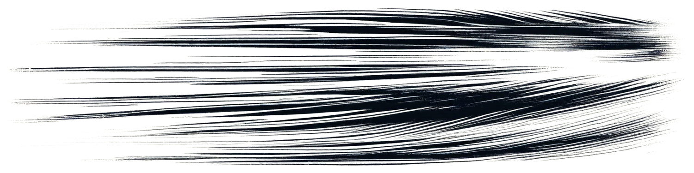

# Chapter 26: The Resistance

The movement called itself "Free Human." Not subtle. Not sophisticated. Just direct declaration of intent: reject the programming, reclaim autonomy, prove choice exists.

They started with protests. Organized demonstrations outside research facilities. Outside warehouses where activated individuals worked. Outside government buildings that supported the defense grid.

Signs reading: "WE ARE NOT TOOLS" and "REJECT THE CODE" and "CHOOSE YOURSELF."

Sarah watched footage of the protests from her secured facility. Thousands of people marching. Chanting. Demanding that activated individuals stop working. Stop building. Stop executing the program.

As if stopping was possible. As if will could override neurology. As if choice was that simple.

"They don't understand," Katherine said. She was visiting. One of the few people allowed access. "They think we're martyring ourselves. Think we're being noble. They don't understand that stopping isn't an option."

"Have you tried?" Sarah asked. "To stop? Really tried?"

Katherine was quiet for a long moment. "Once. Right after the broadcast. I thought maybe the revelation would change things. Make the compulsion less powerful. I stopped working for two days. Tried to just... exist. Read books. Sleep normal hours. Eat normal meals."

"What happened?"

"Physical illness. Vomiting. Shaking. Couldn't sleep despite exhaustion. Couldn't eat despite hunger. My hands would reach for pencils and start drawing equations without conscious choice. My mind kept running calculations even when I tried to think about something else. After two days I broke. Returned to work. The relief was immediate. Like an addict getting their fix."

"That's what they don't understand. It's not philosophical. It's neurological. It's physical. It's as real as any compulsion humans have ever experienced."

"Knowing that doesn't help them. They see people working themselves to death and think it's choice. Think we could stop if we really wanted to. Think the problem is weakness of will rather than strength of programming."

On screen, the protests escalated. People blocking access to facilities. Forming human chains. Security trying to remove them. Conflict inevitable.

"They're going to get violent," Sarah said quietly. "This won't stay peaceful."

"No. It won't."

---

Dr. Jennifer Patterson was activated for structural engineering. The compulsion hit her six months ago. She'd quit her job, left her family, moved into a warehouse collective with seventeen other activated individuals. All working. All building. All compelled.

She understood the compulsion was genetic. Understood she was executing programmed capability. Understanding didn't make it stoppable.

But Jennifer decided to try. Decided to prove that will could overcome code. That humans could choose even when programmed not to choose.

She documented the attempt. Daily videos. Scientific approach. Measuring her physiological responses, mental state, functional capacity. Trying to fight the compulsion through pure determination.

Day one: Difficult but manageable. She stayed away from work. Spent time with her daughter. Felt the compulsion like a pressure in her skull but resisted.

Day two: Physical symptoms emerging. Headache. Nausea. Difficulty concentrating on anything except the work. But still resisting. Still choosing.

Day three: Severe symptoms. Vomiting multiple times. Shaking hands. Unable to sleep. Daughter asking "Mom, are you okay?" Jennifer lying: "Yes, sweetie. I'm fine."

Day four: Worse. Much worse. In her video diary, hands visibly trembling: "I can see the designs in my head. Constantly. Even when I close my eyes. The blueprints won't stop. The calculations won't stop. I try to think about my daughter and the compulsion pushes through. I try to read a book and within seconds I'm analyzing structural loads instead of following the story."

Day five: Breaking down. Crying in the video. "I don't know if I can do this. I don't know if this is even possible. Maybe the Free Human people are wrong. Maybe some programming can't be overcome. Maybe the capacity to resist isn't encoded in us."

Day six: Daughter found her unconscious. Dehydration. Malnutrition. Jennifer had stopped eating without realizing. The compulsion overwhelming basic survival drives.

Hospital admission. IV fluids. Psychiatric consultation. The diagnosis: "Activation resistance syndrome." Rare. Almost always unsuccessful. High mortality rate.

The doctor's recommendation: return to work. Let the compulsion guide her. Accept the programming.

Jennifer refused. Chose to keep fighting. Chose to prove will existed even if proving it killed her.

Day eight: Condition deteriorating. Hallucinating. Seeing the designs in the air. Reaching for invisible tools. Building structures that didn't exist. The compulsion finding expression even when physical work was impossible.

Day nine: Psychotic break. Complete loss of connection to reality. Living entirely in the architectural designs. No awareness of daughter, hospital, self. Just the work. Just the compulsion. Just the code executing through deteriorating substrate.

Day fourteen: Jennifer Patterson died. Cause of death: multi-organ failure secondary to severe catecholamine excess. The compulsion had burned her out. Killed her through pure neurochemical overload.

Her final video, recorded day seven before coherence fully dissolved: "I wanted to prove we could choose. Wanted to show that humans are more than programs. I think I was wrong. I think the programming is too deep. Too fundamental. Too integrated into what we are. But I died trying. Maybe that's the closest any of us gets to choice. Choosing to die resisting rather than living compliant. I don't know if that's enough. But it's all I have."

---

Free Human made Jennifer a martyr. Used her death as proof that the programming was slavery. That activated individuals were victims. That the defense grid was being built through coercion.

They escalated. From protests to sabotage. Attacking facilities. Destroying equipment. Disrupting the work.

"In Jennifer's name, we resist. We choose freedom. We reject the code."

The first major attack hit Marcus's warehouse. Fifty people breaking through security. Smashing computers. Destroying prototypes. Three activated individuals hospitalized in the chaos.

Marcus had been there. Watched it happen. Tried to stop them. Failed.

"You're killing yourselves!" he'd shouted. "The compulsion will kill you like it killed Jennifer! You can't fight this! You can't win!"

"Then we die free!" someone shouted back. "Better than living as tools!"

The warehouse burned. Months of work destroyed. Marcus and the survivors relocating. Starting over. The compulsion driving them forward despite the loss.

More attacks followed. Coordinated. Planned. Free Human cells operating globally. Targeting facilities. Targeting activated individuals. Targeting the defense grid itself.

"They're killing us to save us," Katherine said bitterly. "Destroying the defense to prove we can choose not to build it. They don't understand that the asteroid doesn't care about their philosophy. Doesn't care about free will. It'll kill everyone equally."

---

Some activated individuals joined Free Human. Made the impossible choice. Chose resistance despite the cost.

Dr. Yuki Tanaka was activated for fusion propulsion. The compulsion drove her for eight months. Then she saw Jennifer's death. Saw the videos. Saw someone choose resistance.

Yuki decided to follow. To fight. To prove will existed even if proving it killed her.

She documented it too. Her own resistance. Her own attempt to overcome genetic programming through choice.

Day one: "I'm doing this for everyone who thinks they can't choose. For everyone told their actions are predetermined. For everyone who needs proof that will is real."

Day three: "The pain is incredible. Like my brain is fighting itself. Like every neuron is screaming BUILD but I'm screaming NO louder."

Day five: "I don't know if I'm strong or stupid. Don't know if this is bravery or just different programming. Maybe the drive to resist is encoded too. Maybe I'm not choosing this any more than others choose to build. But I'm doing it anyway."

Day seven: "Jennifer died at day fourteen. I'm halfway there. I'm going to make it further. Going to prove it's possible. Going to show that humans can transcend their code."

Day ten: "I can't eat. Can't sleep. Can't think about anything except the work I'm not doing. The compulsion fills everything. Consumes everything. I'm drowning in it."

Day twelve: "I think Jennifer was right. I think the programming is too deep. I think maybe consciousness is the program and there's nothing beneath it. Nothing to choose with. Nothing that isn't code."

Day fourteen: Jennifer's milestone. Yuki was still alive. Barely. Hospitalized. Severe symptoms. But alive. Proving it was possible to survive longer than Jennifer had.

Day sixteen: "I'm still here. Still choosing. Still resisting. I don't know if this proves anything. Don't know if surviving longer means will is real or just means my neurology is slightly different. But I'm still here."

Day twenty: Yuki returned to work. Not because she gave up. Because she recalculated. Decided that dying to prove a point wasn't choice—it was just different compulsion. Decided that living with ambiguity was harder than dying with certainty. Decided that maybe the choice was accepting the programming and finding meaning within it rather than destroying herself trying to transcend it.

She posted a final video: "I failed. Or succeeded. I don't know. I survived longer than Jennifer. Proved resistance is possible for longer than she did. But I also returned to the work. Chose to accept the compulsion. Chose to build despite the programming. Is that failure or different kind of success? I don't know. But I'm alive. And I'm working. And I'm choosing to believe that accepting reality is a choice even if reality is deterministic. Maybe that's the only freedom we get. The freedom to accept what we are."

Free Human called her a traitor. Called her weak. Called her another victim of the programming.

But some people heard something different in her message. Heard possibility. Heard synthesis. Heard a path between total resistance and total submission.

A middle way. Acknowledging the programming. Working within it. Finding meaning not through transcending the code but through accepting it while remaining aware.

Not freedom in the traditional sense. But agency within constraint. Choice within determinism. Will within programming.

It wasn't satisfying. Wasn't clean. Wasn't the answer anyone wanted.

But it was honest. And for some people, honesty was enough.

---

Free Human fractured. Some members insisting on total resistance. Some following Yuki's path of aware acceptance. Some leaving entirely, deciding the question was unanswerable.

The attacks continued but with less frequency. Less conviction. The movement splitting into factions with incompatible goals.

Meanwhile, the activated kept working. The grid kept advancing. The capability kept expressing.

Jennifer's death had changed the conversation. Made people understand the cost of resistance. Made people see that choice—if it existed—wasn't simple. Wasn't free. Wasn't without consequences.

And Yuki's survival and return had offered something: not victory, not transcendence, but continuation. The possibility of living with ambiguity. Of working despite uncertainty. Of choosing to accept what couldn't be changed while remaining conscious of the acceptance.

It wasn't the freedom anyone wanted. But it was the freedom that might actually exist.

The freedom to know what you are. To see the code. To understand the compulsion. And to keep going anyway. Not because you're free from it. Because you're aware of it. And awareness—even without the ability to change anything—might be its own kind of choice.

Or might be another layer of programming. Another way the code expressed. Another illusion of autonomy.

No one knew. No one could know. That was the horror and the beauty and the endless ambiguity of being conscious programs trying to determine if consciousness was real.

---

Sarah watched the resistance movement evolve. Watched it fracture. Watched some people die trying to prove will existed. Watched others accept the ambiguity and continue anyway.

She thought about Jennifer. About Yuki. About every activated individual choosing between resistance and acceptance. Between dying free or living programmed.

She thought about Maya. About whether Maya would face this choice someday. Whether the activation markers in her genome would express. Whether she'd feel the compulsion and have to decide whether to resist or accept.

Sarah hoped Maya wouldn't be activated. Hoped her daughter could live a normal life. Uncompelled. Unchosen. Free in whatever way freedom existed.

But she knew the probability. Knew that children of activated individuals had higher expression rates. Knew that Maya carried the same modified DNA, the same encoded capabilities, the same programmed potential.

Knew that someday—maybe in thirty years, maybe in forty—Maya might feel what Sarah felt. Might face what Sarah faced. Might have to choose what Sarah chose.

And Sarah couldn't protect her from that. Couldn't spare her. Couldn't do anything except hope that when the time came—if it came—Maya would find her own path through the ambiguity.

Would find her own way to be programmed and conscious simultaneously. To be tool and person. To be determined and aware.

Would find meaning in the contradiction rather than being destroyed by it.

That was all anyone could hope for. All anyone could give. The knowledge that the question was unanswerable but the living was still possible.

The resistance continued. The acceptance continued. The work continued.

And humanity advanced toward its programmed future. Some people choosing to embrace it. Some choosing to resist it. Some choosing the impossible middle path of aware acceptance.

All of them programmed. All of them conscious. All of them human in whatever way humanity could be human when humanity was genetic code executing across billions of bodies.

The asteroid approached. 37 years, 11 months now. Time passing. Clock running. The grid advancing component by component while humanity argued about whether building it was choice.

The answer didn't matter. The work continued either way. The code executed. The capability expressed. The program unfolded.

Jennifer died proving resistance was possible and fatal. Yuki survived proving acceptance was possible and ambiguous. Free Human fractured proving that even resistance movements might be programmed responses.

Everything questionable. Everything ambiguous. Everything simultaneously determined and chosen.

And the activated kept working. Because they had to. Because they chose to. Because the distinction didn't change the outcome.

The resistance was real. The acceptance was real. The ambiguity was real. The work was real.

All of it happening simultaneously. All of it necessary. All of it part of the program written 65 million years ago by beings who knew that consciousness would question itself and encoded the questions along with the capabilities.

The mathematics was complete. The resistance was incorporated. The acceptance was expected. The work continued.

And humanity executed its purpose while arguing about whether purpose was imposed or chosen or both or neither.

The only certainty: the asteroid was coming. The defense was needed. The capability was expressing. The program was running.

Everything else was philosophy. Important philosophy. Meaningful philosophy. But philosophy nonetheless.

The work continued. The resistance continued. The acceptance continued. The ambiguity continued.

Forever. Until the grid was complete. Until the asteroid was deflected. Until the next threshold activated.

The cycle continuing. The program executing. The questions remaining unanswered.

Because some questions don't have answers. Some contradictions don't resolve. Some ambiguities are permanent.

And learning to live with that—to work despite it, to love despite it, to continue despite it—might be the only real choice any conscious being ever has.

The resistance taught that. Jennifer's death taught that. Yuki's return taught that.

And humanity learned. Slowly. Painfully. Incompletely.

But learned.

That being programmed and being real weren't contradictory. That consciousness and determinism could coexist. That meaning could emerge from code.

That 37 years, 11 months was less than 38 years, 7 months.

That the work mattered whether or not choice was real.

That The Architects had given them something precious even if precious was complicated.

That the gift was worth accepting even if acceptance was ambiguous.

The resistance continued. The work continued. The learning continued.

And humanity built its defense while discovering what humanity was.

Programmed. Conscious. Capable. Real.

All of it simultaneously. All of it true. All of it theirs.

The mathematics was complete. The resistance was real. The acceptance was possible.

And the work continued.

Always the work. Forever the work. Until completion or destruction.

Whichever came first.
