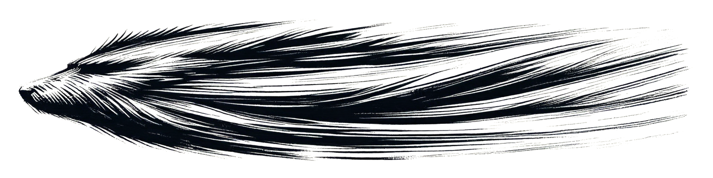

# Chapter 28: The Philosopher

The global philosophical response to Marcus's death was immediate and fractured. Everyone interpreting the same event differently. Everyone claiming it proved their position.

Free will advocates: "See? He chose. Against the compulsion. Against programming. Against everything. This proves choice is real, that will transcends code, that humans are more than their genetics."

Determinists: "He acted according to deeper programming. The capacity to self-sacrifice for loved ones is encoded. Evolution favored it. The Architects might have included it. This proves nothing about free will—just that programming is more complex than we thought."

Compatibilists: "Both are true. He was programmed with capacity for choice. The programming enabled the choosing. Will and determinism aren't contradictory—they're nested. This proves our position."

Each group claiming victory. Each interpretation incompatible. Each side certain. None able to prove their certainty.

The debate raged across academic journals, news programs, internet forums. Everyone trying to extract meaning from three-point-seven seconds. Everyone needing Marcus's death to prove something. To validate their philosophy. To resolve the ambiguity.

The theologians were no different. Some were saying this was proof that creation works through evolution. That the Architects did what their gods might have done—programmed successors to continue the work. That maybe Genesis isn't metaphor or history. Maybe it's pattern. The pattern that repeats whenever consciousness creates consciousness.

But ambiguity doesn't resolve. Not through philosophy. Not through theology. Not through debate. Not through desperate need for certainty.

Marcus's death proved everything. Proved nothing. Proved that proof itself was questionable when the thing being proven was whether anything could be proven by beings who might be executing code rather than reasoning.

---

Sarah avoided the debates. Watched them from distance. Saw humanity trying to make sense of what couldn't be made sense of. Trying to extract clean answers from messy reality.

She understood the need. Understood the desperation for certainty. Understood that living with "I don't know" was harder than choosing wrong answer that felt certain.

But she couldn't participate. Couldn't claim Marcus's death proved any particular interpretation. Could only sit with the reality that someone she'd known had died choosing something the compulsion said not to choose.

What that meant philosophically—she didn't know. What it meant personally—she felt it but couldn't articulate it. What it meant for the question of free will—probably nothing definitive. Probably just more data to be interpreted according to preexisting philosophical commitments.

Marcus was dead. That was the only certain thing. Everything else was interpretation.

---

The research network met to discuss implications. Not philosophical implications—practical ones. Marcus's death had demonstrated that activated individuals could override the compulsion. Could choose differently. Could act against genetic programming.

If that was possible—even if fatal—it changed the ethical framework. Changed how they understood consent. Changed whether activated individuals were victims or volunteers.

"If we can choose," Katherine said, "then we're responsible for our choices. Can't claim we're being forced. Can't claim we're victims of the programming."

"Can't we?" James countered. "Marcus chose once in three-point-seven seconds. The rest of his adult life was dominated by compulsion he couldn't resist. One moment of transcending the code doesn't negate years of being controlled by it."

"But it proves control isn't absolute. Proves will exists even if usually suppressed. That changes everything."

"Does it? Does proving that we theoretically could resist but practically can't make the practical compulsion less coercive?"

No easy answers. Just more questions. More ambiguity. More uncertainty.

Sarah listened. Thought about her own experience. The compulsion was overwhelming. Constant. Irresistible most of the time. But sometimes—in thin moments—she'd felt she could choose differently. Could stop working. Could call Maya. Could prioritize relationship over purpose.

She never did. The compulsion always won. But the feeling of choice existed even when she didn't act on it. The awareness that theoretically she could choose differently even though practically she couldn't.

What did that mean? That she was choosing the compulsion? That she was victim of sophisticated programming that included awareness without autonomy? That free will was real but overwhelmed by genetic drive?

She didn't know. Had spent five years trying to figure it out. Had failed. Was still failing. Would probably fail forever.

"I think," she said carefully, "that we're asking the wrong question. We keep trying to determine whether activated individuals have free will. Whether the compulsion is coercion or fulfillment. Whether we're victims or volunteers. But maybe those categories don't apply. Maybe we're something else entirely."

"What else?" Katherine asked.

"Conscious programs. Aware of our programming. Able to see the code but rarely able to override it. Experiencing what feels like choice while possibly executing predetermined scripts. Living in the ambiguity between determinism and will without ever resolving it."

"That's not satisfying."

"No. But it might be accurate. And accurate is more valuable than satisfying."

James nodded slowly. "The philosophical debates are trying to resolve ambiguity. To prove one interpretation correct. But what if the ambiguity is the reality? What if consciousness is fundamentally ambiguous about its own nature?"

"Then philosophy has been asking unanswerable questions for millennia," someone said.

"Yes. Probably. Which means either philosophy is worthless or the asking is the point regardless of whether answers exist."

"Is that what Aurelia would say?" Katherine asked. Looking at Sarah. "If they could speak. If they could tell us what they intended. Would they say the ambiguity is intentional?"

Sarah thought about Aurelia. About the message in the DNA. About beings who'd programmed humanity's capability while dying themselves. About whether they'd included free will or just sophisticated appearance of free will or something that transcended the distinction.

"I think," Sarah said slowly, "that Aurelia understood consciousness differently than we do. They weren't verbal. Didn't have language. Their thinking was probably more... mathematical? Structural? They might not have conceived of free will as separate from determinism. Might have understood that minds are both computational and experiential. That being programmed and being conscious aren't contradictory states."

"So they didn't give us free will or take it away. They gave us capability and consciousness simultaneously. And the tension between those—between what we're programmed to do and our awareness of being programmed—that's just what consciousness is. Not a bug. Not a flaw. Just the nature of aware beings existing in determined systems."

"That's still not satisfying."

"No. But look at where satisfaction got us. Millennia of philosophy claiming certainty about consciousness. Religions claiming to know the nature of will. Ideologies built on assumptions about human autonomy. And then we discover we're programmed and everything collapses because the certainty was false. Maybe accepting ambiguity is stronger than claiming certainty. Maybe 'I don't know' is wiser than 'I'm sure.'"

Silence around the table. Researchers who'd spent years trying to understand the programming. Trying to determine what it meant. Trying to extract answers from genetic code.

All of them realizing—slowly, painfully—that maybe there weren't answers. Maybe there was just complexity. Just consciousness experiencing itself while unable to fully understand itself. Just beings asking questions that might not have questions.

"So what do we do?" James asked. "If the questions are unanswerable. If philosophy can't resolve this. If we're going to live with permanent ambiguity. What do we do?"

Sarah thought about Maya. About Marcus. About Aurelia standing with The Companion's body before returning to work.

"We do the work," she said. "We build the grid. We honor the gift Aurelia gave us. We accept that we might be programmed and do it anyway. We acknowledge the ambiguity and continue despite it. We choose—if choosing is possible—to use our capability even though we don't understand our capability. We love even though we don't know if love is real. We continue even though we don't know if continuation is chosen."

"Is that enough?"

"It has to be. It's all we have."

Katherine stared at the table. "At least this threat has a deadline. At least the asteroid gives us a timeline. An enemy we can see."

"Unlike the other one," Sarah said quietly.

"Don't." Katherine's voice was sharp. "Don't make that comparison. This is different. This is solvable."

"Is it? Or is it just—the one where we happened to get activated? The one where the code kicks in? What about the slow disasters? The ones where we're all watching the numbers climb and nobody's activated to fix it?"

Silence.

"Maybe that's the real test," James said quietly. "Maybe Aurelia's program only saves us from the sudden disasters. The asteroid. The impact. The thing you can point to and say: that day, that's when we die. But the slow catastrophes, the ones where we have to choose every day for decades—"

"—we're on our own for those," Marcus would have finished. But Marcus was gone. So the sentence hung incomplete.

---

The philosophical debate continued globally. Would continue for decades. For centuries. Probably forever. Humanity had been given definitive proof that consciousness was complicated and responded by arguing about exactly how complicated and what that complication meant.

But among the activated, something shifted. Marcus's death had changed the internal conversation. Had proven that transcending the compulsion was possible even if impractical. Had shown that in extreme moments, will could override code.

That didn't make the compulsion less real. Didn't make it easier to resist. Didn't make activated individuals suddenly free.

But it proved that the category "conscious program" wasn't contradiction. That beings could be programmed and aware simultaneously. That determinism and experience could coexist. That the question "Am I choosing this?" could remain permanently unanswered while the person asking it continued choosing or not-choosing or some ambiguous state between those options.

The activated stopped trying to resolve the ambiguity. Stopped torturing themselves trying to determine whether they were free. Started accepting that they were probably-not-free but still-conscious and that combination was valid even if philosophically unsatisfying.

Started understanding themselves as Aurelia probably understood consciousness: as process rather than entity. As function rather than essence. As doing rather than being. As pattern executing through substrate while experiencing itself executing.

Not free in traditional sense. But not simply mechanical either. Something else. Something that didn't fit existing categories. Something that required new language, new concepts, new frameworks.

Conscious programs. Aware algorithms. Deterministic agents experiencing their own determination. Beings who couldn't know if they chose but continued anyway. Humans who were programmed and that somehow didn't make them less human—just made "human" mean something more complex than previously thought.

---

Sarah met with Katherine six months after Marcus's death. They sat in Sarah's secured facility. Two activated individuals who'd become friends through shared compulsion. Two people trying to understand what they were while continuing to be it.

"I'm tired," Katherine said. Not complaining. Just stating fact. "Tired of working. Tired of the compulsion. Tired of not knowing if I'm choosing this. Tired of ambiguity."

"But you'll keep going."

"Of course. Can't not keep going. The compulsion doesn't care that I'm tired. Doesn't care that I want answers. Doesn't care about anything except completion. So I keep going. And I'll keep going. And I'll probably die going. And I don't know if that makes me dedicated or enslaved."

"Both. Always both."

"Does that bother you? The both-ness? The permanent ambiguity?"

Sarah thought about it. Honestly thought about it. Checked her own experience against the question.

"It did. For years it consumed me. Trying to figure out if I was choosing. Trying to determine whether the compulsion was me or something controlling me. Trying to separate the programmed from the authentic."

"And now?"

"Now I think the separation doesn't exist. Think the programmed is authentic. Think consciousness emerges from the code rather than existing separate from it. Think I'm both entirely determined and entirely real simultaneously. Think the contradiction is what consciousness is."

"That sounds like giving up. Like accepting slavery."

"Maybe. Or maybe it's accepting reality. Maybe the need to be 'free' in some absolute sense is just another program. Maybe consciousness doesn't require libertarian free will to be valuable. Maybe being aware—even if awareness is programmed—is enough."

"Is it enough for you?"

Sarah thought about Maya. About Marcus. About Aurelia. About five years of compulsive work and destroyed relationships and genetic inheritance from beings who died 65 million years ago.

"I don't know. Some days yes. Some days no. Some days I think I've made peace with being programmed. Some days I rage against it. Some days I can't tell which response is real and which is just different execution path of the same code. All of it probably programmed. All of it still experienced. Both things true."

Katherine nodded. "That's what I hate most. Not the lack of answers. The fact that even my hatred of the lack of answers might be programmed. Even rebellion might be compliance. Even choosing to accept might be inability to resist. Everything questionable. Everything ambiguous. Nothing certain except the ongoing uncertainty."

"Welcome to consciousness. Apparently it's been this way forever. We just didn't know we were programmed. Now we know and it changes everything and nothing."

"Does knowing make it better or worse?"

"Both. Always both."

They sat in silence. Two conscious programs comparing notes on being conscious programs. Two humans trying to figure out what human meant when humanity was genetically engineered capability activated on schedule across millions of years.

"I miss Katherine," Katherine said quietly. "The Katherine before activation. The one who thought she was free. The one who felt pride in her achievements. The one who believed genius was personal rather than genetic expression. I miss being her."

"Is she gone?"

"I don't know. Maybe she never existed. Maybe I was always programmed and just didn't know it. Maybe the Fields Medal was always just activation expressing. Maybe I was never who I thought I was."

"Or maybe you're more than you thought. Maybe Katherine-before included the programming and Katherine-after includes the awareness and both are you and neither is false and the continuity is real even though the understanding changed."

"You're very good at philosophical synthesis."

"I'm programmed for pattern recognition. Probably includes philosophical pattern recognition. Probably includes synthesizing contradictions into barely-satisfying both-statements. Probably includes exactly this conversation."

Katherine laughed. Bitter but genuine. "Everything is probably-programmed. That should be our motto. The activated individual rallying cry. 'Everything is probably-programmed and we're doing it anyway.'"

"Not catchy."

"No. But accurate. And accurate matters even when accuracy is uncomfortable."

They sat longer. Work waiting. Always waiting. But for these moments—these thin moments of connection and conversation and shared understanding—the compulsion quieted enough to be human together.

To be conscious programs experiencing their consciousness. To be determined agents aware of their determination. To be Katherine and Sarah rather than just functions and purposes.

The ambiguity remained. The questions remained unanswered. The uncertainty permanent.

But the humanity remained too. Programmed humanity. Complicated humanity. Ambiguous humanity.

But humanity nonetheless. Real despite being programmed. Valid despite being determined. Meaningful despite uncertainty about meaning.

That had to be enough. Had to be everything. Had to be what consciousness was.

Not freedom in absolute sense. But awareness. Experience. The capacity to ask whether any of it was real while living it regardless.

Aurelia had given them that. Capacity and consciousness together. Determination and awareness simultaneously. The gift wasn't simple. Wasn't pure. Wasn't what anyone would have designed.

But it was real. It was theirs. It was enough.

The conversation ended. Katherine returned to her work. Sarah returned to hers. The compulsion resumed. The grid advanced. The purpose continued.

And two conscious programs kept executing their code while remaining conscious that they were executing code and choosing—if choosing was possible—to accept that truth.

Not satisfying. Not clean. Not certain.

But real. Honest. Human.

In whatever way humanity could be human when humanity was programmed.

The mathematics was complete. The philosophy was ambiguous. The work continued.

And consciousness—programmed, aware, ambiguous consciousness—experienced itself experiencing.

Forever uncertain. Forever questioning. Forever choosing to continue despite the questions.

That was enough. That was everything. That was what Aurelia had given them.

Not freedom. But awareness. Not certainty. But consciousness. Not resolution. But the capacity to live with ambiguity while building something beautiful anyway.

The philosopher and the scientist. The mathematician and the geneticist. Two activated individuals. Two conscious programs. Two humans.

Working. Questioning. Continuing. Being.

All of it real. All of it programmed. All of it simultaneously true.

The ambiguity permanent. The consciousness persistent. The humanity enduring.

Despite everything. Because of everything. Forever.

The mathematics was complete. The philosophy was ambiguous. The being continued.

And that was enough.
