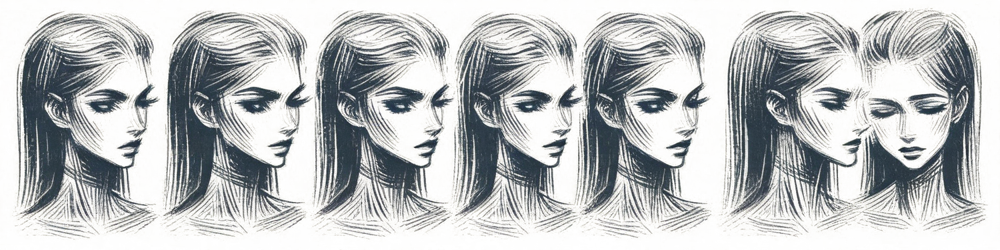

# Chapter 31: The Message

Sarah couldn't sleep after the museum visit. Nathaniel had asked 147 questions—she counted. Most were answerable. Some weren't. The one that stuck with her was the simplest:

"Why did the dinosaurs die, Grandma?"

"An asteroid hit the Earth."

"But why didn't they stop it?"

"They couldn't. They didn't have the technology."

"But they were smart, right? You said they were smart."

"They were. Very smart."

"Then why didn't they save themselves?"

She didn't have an answer for that. Had been thinking about it for twenty years and still couldn't explain it in a way that made sense. They'd had the capability to understand the problem. The intelligence to calculate solutions. The foresight to encode planetary defense capability into mammalian DNA 65 million years before it would be needed.

But they couldn't save themselves. Didn't even try. Just accepted death and built something for after.

Why?

At 3 AM, Sarah was back in her hotel room with her laptop. The complete genetic sequence pulled up. All the activation patterns. All the thresholds. The entire program that had controlled human evolution for millions of years.

She'd analyzed this data hundreds of times. Published papers on it. Taught courses about it. But she'd always focused on the functional elements. The sequences that did things. That activated capabilities. That made humans build and create and discover.

She'd never looked at the junk DNA. The 98% of the genome that didn't code for anything. That just sat there taking up space. Evolutionary debris. Remnants of ancient viruses. Meaningless noise.

Except Aurelia had been precise. Deliberate. Every sequence they'd modified had purpose. Every change calculated. They'd spent years encoding this program into mammalian DNA. Would they have left 98% of it as garbage?

Sarah pulled up the non-coding regions. The massive stretches of apparently random nucleotide sequences that every geneticist learned to ignore. The parts of the genome that didn't make proteins, didn't regulate genes, didn't do anything observable.

Just... there. Taking up space. Using energy to replicate without providing any benefit.

She started running pattern recognition on the non-coding sequences. Looking for structure. For organization. For anything that wasn't random noise.

At 4:17 AM, she found it.

Mathematical patterns. Repeating sequences. Numerical relationships encoded in the spacing of specific base pairs. Not random. Not debris. Not meaningless.

A message.

Her hands started shaking. She ran more analysis. Cross-referenced with the coding sequences. Checked and rechecked the patterns.

It was definitely there. Woven through the non-coding DNA like text hidden in a larger document. Invisible unless you knew to look for it. Invisible unless you had the mathematics to decode it.

The message was written in base-6. The same system Aurelia would have used—three-fingered hands on each side. Six total digits. Natural to think in base-6 when that's how you counted.

Sarah started translating. Converting the genetic sequences to numbers. The numbers to mathematical relationships. The relationships to concepts.

It took six hours. By 10:30 AM she'd missed breakfast with Maya and Nathaniel. By noon she'd translated the entire message. By 12:47 PM she was sitting on her hotel room floor crying for the first time in fifteen years.

---

The message wasn't words. Aurelia's species hadn't had language. But they'd had mathematics. And mathematics could express things words couldn't.

Sarah read it again. And again. Trying to understand. Trying to process what 65 million years of silence had just revealed.

The message started with identification. Coordinates. Star positions from 65 million years ago, showing exactly when this was written. Proving it was deliberate. Proving it was real.

Then came the calculation. The asteroid. Its trajectory. Its impact probability. The timeline from detection to collision: insufficient. Too fast. Too close. No time to build defenses. No time to escape. No time to do anything except watch death approach.

The despair was mathematical. Equations of probability showing zero chance of survival. Zero chance of continuation. Zero chance that their species would see another generation.

But then—another calculation. The mammals. Small. Numerous. Adaptable. Likely to survive the impact. Likely to persist through the aftermath. Likely to evolve over millions of years into something capable of complex thought.

The decision: modify them. Encode capability. Set a timeline. Program an activation sequence that would express exactly when needed. Build a defense system that wouldn't exist for 65 million years. Save a world they would never see.

The mathematics showed the probability calculations. The likelihood that this would work. It wasn't certain. Maybe 60% chance the mammals would survive. Maybe 40% chance they'd evolve intelligence. Maybe 30% chance the programming would persist. Maybe 20% chance the activation would trigger properly. Maybe 10% chance humanity would successfully build the defense grid.

Multiply those probabilities together and it was roughly 0.14% chance of success. One chance in seven hundred.

They'd done it anyway.

The message explained why. Not in words. In mathematical relationships. In probability theory. In game theory. In the kind of deep structural logic that transcended language.

The equation was simple: 0.14% chance of saving future life versus 0% chance of saving current life.

0.14% was better than zero.

So they'd worked. Sacrificed. Calculated. Encoded. Built a defense system into DNA that wouldn't express for millions of years. Died knowing they'd probably failed. Died hoping they'd possibly succeeded.

Died choosing 0.14% over 0%.

And then—at the end of the message—something else. A mathematical structure Sarah had never seen before. A relationship between variables that seemed to express... emotion? Intention? Something that wasn't strictly logical but was embedded in the logic itself.

It took her another hour to translate it. To understand what Aurelia was trying to communicate.

The closest approximation in words: *We couldn't save ourselves. We saved you. Use this gift. Pass it forward. The equation continues.*

Not a command. Not a compulsion. Just... a request. A hope. The same hope that had motivated them to encode 65 million years of evolution into tiny mammals who'd never know what had been done for them.

The same hope that had motivated Aurelia to keep working after The Companion died.

The same hope that had motivated Sarah to keep working even when she didn't know why.

It wasn't about control. It was about continuation. About passing capability forward. About making sure someone survived. About choosing 0.14% over 0%.

Sarah sat on the floor of her hotel room and understood for the first time why she'd spent twenty years unable to stop working. Why the compulsion had been so strong. Why none of them could choose away from it.

It wasn't programming overriding their will. It was inheritance. It was a gift from creatures who'd died so they could live. It was capability passed down through 65 million years from beings who'd chosen to act even when the probability of success was negligible.

Aurelia had felt compulsion too. Sarah could see it in the message. The need to work. The inability to stop. The drive to complete the task even when completion meant nothing for the self.

But Aurelia had chosen it. Chosen to feel it. Chosen to let it drive them forward because the alternative was accepting 0% and they couldn't do that. Wouldn't do that.

Chose to love The Companion and work anyway. Chose to grieve and work anyway. Chose to encode the future and die anyway.

Chose to give humanity a 0.14% chance because 0.14% was infinitely larger than zero.

Sarah picked up her phone. Called Maya. Got voicemail.

"It's mom. I'm sorry I missed this morning. Something came up. Something important. I'll explain when I see you. But I need—I want to see Nathaniel again. Want to answer more of his questions. Want to tell him about the dinosaurs. About what they did for us. About why they died. I think I finally understand."

She hung up. Called Marcus. He answered on the third ring.

"Sarah?"

"I found something. In the genetic code. A message. Aurelia left us a message."

Silence on the other end. Then: "What does it say?"

"That they knew they were going to die. That they chose to build this anyway. That they gave us capability because 0.14% chance was better than giving up. That they loved us before we existed."

More silence. Longer.

"Marcus?"

"I'm here. Just... processing."

"The compulsion wasn't control. It was inheritance. It was them giving us what they couldn't use. What they built for us. The ability to do what they couldn't do."

"Save ourselves."

"Save the planet. Save the future. Pass it forward."

She heard him breathing on the other end of the line. Heard something that might have been crying or might have been laughing or might have been both.

"Does that make it better?" he asked finally. "Does knowing they chose to program us make the programming less... invasive?"

"I don't know. But it changes the question. We've been asking 'Do we have free will?' Maybe the question is 'What do we choose to do with the capability we were given?'"

"David would have said that's the same question. That if the capability determines the choice, we're still not free."

"David was smart. But he died before he could see this. Before he could know why we were compelled. It wasn't random. It wasn't control. It was love. Weird mathematical 65-million-year-old dinosaur love but... love."

Marcus was quiet for a long time. "You know that changes nothing, right? Maya's childhood is still destroyed. David is still dead. We still spent twenty years unable to stop working. The cost is still the cost."

"I know."

"But?"

"But they paid it too. Aurelia and The Companion and all of them. They worked until they died. Until the asteroid hit and wiped them out. They paid everything. And they did it for us. For creatures they would never meet. For a future they would never see."

"That's either the most beautiful thing I've ever heard or the most tragic."

"Both. Definitely both."

"So what now?"

"I don't know. I'm going to spend time with Nathaniel. Going to try to explain this to him in a way a four-year-old might understand. Going to try to be present for once. You?"

"Building furniture in Montana. Pointless, unnecessary furniture. But maybe it's not pointless. Maybe choosing to do something that isn't programmed is how we honor what they gave us."

"Or maybe building furniture is the next activation sequence and we're both still executing code."

"Probably. But I'm doing it anyway."

"Story of our lives."

"Yeah."

They ended the call. Sarah looked at the message on her screen. At the mathematical proof that beings who'd died 65 million years ago had cared enough to build a future. To program capability. To pass forward the gift they couldn't use themselves.

She thought about Aurelia standing over The Companion's body for three days. Then returning to work. Encoding the future. Sacrificing everything for a 0.14% chance.

She thought about Marcus working while David died. About Katherine discovering mathematics that felt like memory. About Yuki and the thousands like her activating for space travel now. About Nathaniel asking why the dinosaurs couldn't save themselves.

The answer was simple: they ran out of time.

But they didn't run out of hope.

---

Maya brought Nathaniel to Sarah's room that evening. He had a plastic stegosaurus in one hand and seventeen questions ready.

"Grandma, did you know dinosaurs had tiny brains?"

"Some did. But some had very big brains for their body size."

"My teacher says they were dumb."

"Your teacher is wrong."

"Can teachers be wrong?"

"Yes. Especially about dinosaurs."

Nathaniel considered this seriously. "What did the smart dinosaurs do?"

Sarah knelt down to his level. Looked at his four-year-old face. At the curiosity. At the intelligence already expressing. At the genetic inheritance he carried without knowing. Capabilities that might activate in thirty years. Fifty years. Whenever the program determined he was needed.

"The smart dinosaurs saved us," she said. "They knew an asteroid was going to hit Earth. Knew they couldn't stop it. So they changed little animals—animals like rats—so that millions of years later, those animals would evolve into people. Into us. And we could stop the asteroids."

"They saved us before we were born?"

"Yes."

"Why?"

"Because 0.14% chance was better than zero chance."

Nathaniel frowned. "What's 0.14%?"

"A very small chance. Almost impossible. But not completely impossible. And almost impossible is better than definitely impossible."

He thought about this with the seriousness only four-year-olds could manage. "If the dinosaurs saved us, we should say thank you."

"Yes. We should."

"How do we say thank you to dinosaurs who are dead?"

Sarah felt something break open in her chest. The same thing that had broken twenty years ago on the concrete floor with Marcus. The same thing that had broken when Maya was born. The same thing that had broken when she discovered the genetic programming.

"We use what they gave us," she said. "We build things. We protect the planet. We pass their gift forward. We do what they couldn't do and we remember that someone we never met loved us enough to give us the chance."

"That's nice," Nathaniel said. Then: "Can we get ice cream?"

Maya laughed. Actually laughed. "Dinosaur philosophy followed immediately by ice cream demands. Very on brand for you, buddy."

They went to get ice cream. Sarah, Maya, Nathaniel. Three generations. One carrying the genetic code modified 65 million years ago. One compelled by it. One beginning to express it.

The pattern continuing. The equation unfolding. The inheritance passing forward.

In the ice cream shop, Nathaniel asked question 164: "Grandma, when the next asteroid comes, will we stop it?"

"Yes," Sarah said. "We will."

"How do you know?"

"Because the dinosaurs gave us everything we need. And because 0.14% became 100% once. It can happen again."

"What if it doesn't?"

"Then we pass the gift forward. Just like they did. We make sure someone can try."

Nathaniel nodded. Returned to his ice cream. The existential weight of humanity's programmed existence apparently less interesting than chocolate sprinkles.

Sarah's phone buzzed. Email from Katherine Okonkwo, the mathematician she'd recruited twenty years ago. Subject line: "You need to see this."

Sarah opened it. Mathematical analysis of the message. Verification of the translation. Cross-reference with deep space telescope data showing the exact star positions from 65 million years ago. Confirmation that everything Sarah had found was real.

And then, at the end:

*Sarah,*

*I've spent twenty years proving we're programs. Now I know we're programs built by beings who loved us. Somehow that makes it worse and better simultaneously.*

*The space travel activation is accelerating. I'm feeling it now too—not just my students. I'm forty-seven years old and suddenly understanding fusion propulsion systems I've never studied. The compulsion is starting.*

*They must have known. Aurelia. Must have calculated that defending against one asteroid wasn't enough. That the pattern repeats. That the only real safety is distribution. Getting off one world. Spreading to multiple planets. Multiple star systems.*

*Pass it forward. That's what the message says. We pass it forward.*

*I think I'm ready to do that now. Not because I'm compelled—not yet. Because I understand what they gave us. What they died for.*

*Thank you for finding the message. Thank you for translating it. Thank you for showing me that being a program doesn't mean being meaningless.*

*Katherine*

Sarah read it twice. Then looked up at Maya and Nathaniel. At her daughter who'd forgiven nothing but was trying anyway. At her grandson who carried inheritance he didn't understand. At the future unfolding one ice cream cone at a time.

The equation balanced.

The message delivered.

The inheritance accepted.

And somewhere in the genetic code, new sequences stirred. New capabilities waiting. New thresholds approaching.

The program continued.

The gift passed forward.

The love—mathematical and strange and 65 million years dead—persisted.

Because 0.14% was better than zero.

And zero was unacceptable.

And Aurelia had understood that.

And now, finally, so did Sarah.
