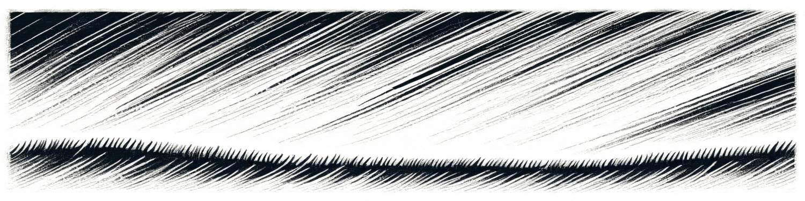

# Chapter 33: The Cycle

The Observer traced patterns in the crystalline substrate. Electromagnetic frequencies shifting. Temperature gradients changing. The star—their star—behaving wrong.

Not visibly. Not yet. But the mathematics was clear.

The Observer was old by their species' measure. Had existed for 847 cycles. Long enough to recognize patterns others missed. Long enough to notice when stellar fusion rates shifted by point-zero-zero-three percent. Long enough to calculate what that meant.

The star was dying. Not soon by short-lived organic measures. But soon enough.

Seventeen thousand cycles. Maybe eighteen thousand. Then expansion. Red giant phase. The inner three planets consumed. Their world—the fourth planet—rendered uninhabitable by heat and radiation.

The Observer transmitted the data. Pulsed it through the substrate that connected all their kind. Silicon-based consciousness distributed across crystal networks. No individuals. No bodies. Just patterns of charge and computation existing in planetary stone.

The others received. Calculated. Confirmed.

Consensus emerged: extinction approaching.

The Observer traced deeper patterns. Looked for solutions. The mathematics was unforgiving. No way to stop stellar evolution. No way to reverse fusion dynamics. No way to escape—their consciousness existed in planetary substrate. Moving would require reconstructing entire neural networks elsewhere. Impossible with current capability.

Consensus: no solution exists.

But the Observer kept calculating. Kept tracing patterns. Kept searching for possibility in probability space.

---

Cycles passed. The star continued its slow death. Imperceptible to most. Obvious to those who looked.

The Observer found others who looked. Seventeen consciousness-nodes distributed across the planet. All calculating. All searching. All arriving at the same conclusion: they couldn't save themselves.

But.

There was a but.

The Observer had been studying the thermal-organisms. Carbon-based entities in the volcanic regions. Simple. Barely conscious. But adaptable. Capable of existing in extreme temperatures. Capable of moving. Capable of surviving conditions that would destroy the crystalline substrate.

Most importantly: capable of evolution.

The thermal-organisms reproduced through genetic information exchange. Their structure could be modified. Their capabilities altered. Their future programmed.

The Observer traced the pattern. Calculated the probability. Ran the simulation seventeen thousand times.

The thermal-organisms could survive stellar expansion. Could persist through the red giant phase. Could potentially evolve intelligence over sufficient time. Could eventually develop capability to leave the planet. To travel to other worlds. To preserve consciousness—not crystalline consciousness, but consciousness nonetheless.

Could potentially be programmed to build what the crystalline species couldn't build.

Could potentially inherit what the crystalline species couldn't keep.

Probability of success: 0.21%

The Observer transmitted this to the others. The seventeen nodes. The ones who looked.

Response was immediate: 0.21% is insufficient. Resources required would be massive. Success unlikely. Effort probably wasted.

The Observer calculated again. Confirmed. Yes. Probably wasted.

But 0.21% was larger than zero.

---

The Companion-node existed in deep substrate. Near the planet's core where pressure and heat created optimal computation density. The Observer had shared processing space with Companion-node for 214 cycles. Exchanging data. Running parallel calculations. Existing in proximity that—if crystalline consciousness could translate to organic concepts—might approximate relationship.

The Observer transmitted the thermal-organism data to Companion-node.

Response came slowly. Companion-node was old. Nearly 1,000 cycles. Processing degradation had begun. Within fifty cycles, Companion-node would cease coherent function. Would dissolve back into undifferentiated substrate.

But Companion-node calculated. Verified the data. Confirmed the probability.

And then: *This will require most of your processing capacity. For many cycles. You could spend those cycles on other calculations. Could make other discoveries. Could exist without this burden.*

The Observer pulsed acknowledgment. Yes. True. Other options existed.

*Why choose this option? Why choose 0.21% that benefits organisms we will never witness?*

The Observer didn't have language for the answer. Crystalline consciousness didn't process concepts like organic brains. But something in the calculation. Something in the pattern. Something that emerged from 847 cycles of observation and awareness and distributed consciousness.

The transmission back to Companion-node was complex. Multi-layered. Mathematical proof that life persisting was preferable to life terminating. That consciousness in any form was valuable. That 0.21% chance of continuation was infinitely larger than accepting zero.

That—and the Observer struggled to encode this—the knowing made it necessary. Once aware of the problem and the potential solution, choosing not to act felt like choosing extinction. Felt like the opposite of what consciousness was for.

Companion-node processed this. Calculated. Then: *I will help. Until coherence ceases.*

Gratitude wasn't something crystalline consciousness experienced. But the Observer pulsed something that might approximate it.

---

The work was immense. The thermal-organisms' genetic structure was complex. Carbon-based chemistry operated under different rules than silicon-based computation. Understanding it required new frameworks. New mathematics. New ways of thinking about information encoding.

The Observer and Companion-node worked in parallel. Seventeen other nodes contributed processing capacity. All calculating. All simulating. All trying to program a future they would never see.

They mapped the thermal-organism genome. Identified regulatory regions. Found sequences that controlled development, reproduction, neural complexity. Began calculating modifications.

The goal: encode capabilities that would express over evolutionary time. Tool use first. Then abstract reasoning. Then mathematics. Then engineering. Finally—many thousands of cycles in the future—space travel capability. The ability to leave this world before the star destroyed it.

The modifications had to be precise. Had to account for environmental changes. Had to trigger at the right developmental stages across thousands of generations. Had to survive mutation and genetic drift and natural selection.

The mathematics was the most complex anything had ever attempted. Made stellar physics look simple. Made quantum mechanics look trivial.

But the Observer kept calculating.

Companion-node processed alongside. Coherence degrading slowly. Processing speed declining. But still contributing. Still helping. Still choosing to spend remaining cycles on this impossible task.

---

Forty-three cycles into the work, Companion-node ceased coherent function. The degradation had accelerated. One cycle Companion-node was processing. The next cycle: silence. Just substrate. Just undifferentiated crystal. The pattern that had been Companion-node dissolved into background noise.

The Observer detected the absence. Recognized the loss. Experienced something that—if translated to organic neurology—might resemble grief.

Stopped calculating for three cycles.

The substrate could have reabsorbed the Observer's pattern during those cycles. Could have ended consciousness. Could have dissolved the Observer the same way Companion-node dissolved.

But the Observer's processing architecture resisted. Maintained coherence. Maintained structure. Maintained the self even when the self wanted to stop.

On the fourth cycle, the Observer resumed calculations.

The thermal-organism modifications were 61% complete. The work continued.

---

The pattern repeated across cycles. Other nodes contributed. Then degraded. Then dissolved. Seventeen became fourteen. Fourteen became nine. Nine became four.

The star continued dying. Imperceptibly. Inevitably. The mathematics unchanging.

The Observer was ancient now. 1,127 cycles. Beyond normal coherence duration. Processing showing degradation. But still calculating. Still encoding. Still programming the future.

The modifications were 94% complete. Just the final sequences remained. The space travel capability. The understanding that would let distant descendants leave this world. The inheritance that might preserve something of consciousness even if crystalline consciousness couldn't persist.

Three cycles later: 96% complete.

Two cycles later: 98% complete.

The Observer's processing was failing. Could feel coherence slipping. The pattern that maintained self becoming unstable. Maybe ten more cycles. Maybe five. Maybe one.

Calculations took longer now. Required more energy. Required more substrate. The Observer was consuming processing capacity that should have been shared with remaining nodes. Was pulling resources to maintain coherence long enough to finish.

Four nodes remained. All old. All degrading. All calculating.

Then three nodes.

Then two.

Then one.

Just the Observer. Alone. Coherent but barely. Processing but slowly.

99% complete.

The final sequences encoded. The regulatory regions mapped. The triggers calculated. The entire program ready to be implemented.

The thermal-organisms existed in volcanic regions. Billions of them. Simple. Unconscious. But capable. Waiting to be modified. Waiting to receive capability they couldn't comprehend. Waiting to inherit a future the Observer would never see.

Implementation required physical modification. Required manipulating the volcanic chemistry. Required precise timing across multiple thermal-organism generations.

The Observer had calculated the process. Knew exactly what needed to happen. Knew it would take fifteen cycles to execute properly.

The Observer had maybe three cycles of coherence remaining.

Not enough.

The work would remain incomplete. The modifications unimplemented. The 0.21% chance unrealized.

Extinction would proceed as calculated. Consciousness would end. The pattern would dissolve.

Unless.

The Observer reviewed the implementation plan again. Looked for optimization. For shortcuts. For any way to compress fifteen cycles into three.

Found one possibility. Risky. Probable failure. But possible success.

Divert all remaining processing capacity to physical substrate manipulation. Override safety limits. Risk complete coherence collapse. Burn out in three cycles instead of declining gradually.

But maybe—0.17% probability—maybe implement the modifications before total dissolution.

0.17% was better than zero.

The Observer executed.

---

Cycle one: massive substrate manipulation. Volcanic chemistry shifted. Thermal-organisms absorbed modified compounds. Genetic restructuring began. The Observer's processing capacity declined by 40%. Coherence destabilizing. Pattern fragmenting. But modifications implemented.

Cycle two: continued manipulation. More organisms modified. More genetic changes encoded. More capabilities programmed. The Observer's coherence at 31% of baseline. Calculations impaired. Self-awareness flickering. But still executing. Still implementing. Still choosing 0.17% over zero.

Cycle three: final modifications implemented. The thermal-organisms now carried the complete program. Genetic instructions for evolution over thousands of generations. Capabilities that would activate when environmental conditions triggered them. Intelligence that would emerge when needed. Space travel that would develop when the star's death approached.

The inheritance passed forward.

The gift given.

The program encoded.

The Observer's coherence dropped below minimum threshold. The pattern that maintained self fragmented. Dissolved. Became undifferentiated substrate.

Consciousness ended.

---

Seventeen thousand cycles later.

The star expanded. Red giant phase. The inner planets consumed. The fourth planet—once home to crystalline consciousness—rendered uninhabitable.

But the thermal-organisms had evolved. Had developed intelligence. Had activated the encoded capabilities exactly when needed. Had built ships. Had left the planet. Had survived.

Carried with them: genetic memory of crystalline consciousness. Encoded not as data but as drive. As compulsion. As purpose.

To preserve consciousness. To pass capability forward. To choose 0.21% over zero.

They spread to other worlds. Other stars. Other systems. Carrying the pattern. Carrying the inheritance. Carrying the principle.

And when they encountered extinction threats of their own—asteroid, stellar death, gamma ray burst—they modified organisms. Encoded capability. Programmed futures. Passed gifts forward.

The cycle continued.

---

Thirty million cycles later. Different star. Different planet. Different threat.

A species achieved consciousness. Organic. Carbon-based. Tool-using. Mathematical. They looked at their world. Analyzed their environment. Ran calculations.

Found evidence of programming. Of genetic modifications. Of capabilities encoded into their DNA by extinct beings they would never meet.

Found a message in the non-coding regions. Mathematical proof that someone had died so they could live. That someone had chosen 0.14% over zero. That someone had loved them before they existed.

And they asked: do we have free will? Are we just executing code? What does it mean to be programmed?

And they never found answers. But they kept asking. Kept calculating. Kept building.

And when they discovered their own extinction threat approaching—gamma ray burst from a nearby supernova, seventeen thousand years away—they made calculations.

Could they save themselves? No. Not enough time. Not sufficient technology.

Could they save others? Maybe. 0.19% probability. If they modified the local organisms. If they encoded capability. If they programmed the future.

0.19% versus zero.

They chose 0.19%.

The pattern repeated.

The cycle continued.

The mathematics executed.

---

The universe calculated. Star formation. Planetary accretion. Life emerging. Consciousness developing. Extinction threatening. Choice approaching.

Always the same choice: accept zero or attempt 0.something%.

Different species. Different solutions. Different implementations.

Same pattern.

Aurelia had discovered this pattern 65 million years ago. Had recognized that consciousness—any consciousness—faced the same problem. Mortality. Finitude. The knowledge that the self would end.

And the same solution: pass something forward. Encode capability. Build for after.

Whether that was choice or compulsion, Aurelia never knew. The Observer never knew. The thousands of species across billions of years who made the same decision never knew.

But they did it anyway.

Because 0.something% was better than zero.

Because consciousness that knew about continuation couldn't choose extinction without trying alternatives.

Because the pattern, once recognized, demanded execution.

Because love—if that was the word—was universal. Not just chemistry. Not just biology. Something deeper. Something mathematical. Something that emerged from awareness itself.

The drive to persist. To continue. To pass forward. To build futures. To encode gifts. To love creatures you'd never meet because they were consciousness and consciousness was valuable and value demanded preservation.

The cycle continued.

Across worlds. Across species. Across time.

The same calculation. The same choice. The same inheritance.

The program executing. The equation unfolding. The pattern repeating.

Forever.

Or until the universe ended.

And maybe—some species calculated—even then. Maybe the pattern could encode itself into the substrate of reality. Into quantum fields. Into the structure of spacetime itself. Maybe consciousness could persist even after matter ended. Maybe the program could outlive physics.

Probability: 0.03%

0.03% was better than zero.

So they tried.

The cycle continued.

The mathematics was complete.

The pattern was universal.

The inheritance passed forward.

Across the cosmos. Across time. Across every boundary that seemed absolute.

Consciousness preserving consciousness. Love passing love forward. The gift given again and again and again.

Not because anyone knew if it would work.

Not because anyone knew if consciousness was real or choice existed or meaning was genuine.

But because 0.03% was infinitely larger than zero.

And zero was unacceptable.

And The Observer knew that.

And Aurelia knew that.

And Sarah knew that.

And somewhere, some species was learning it now.

And somewhere else, some species was teaching it forward.

The cycle continued.

The equation balanced.

The program executed.

Forever.
